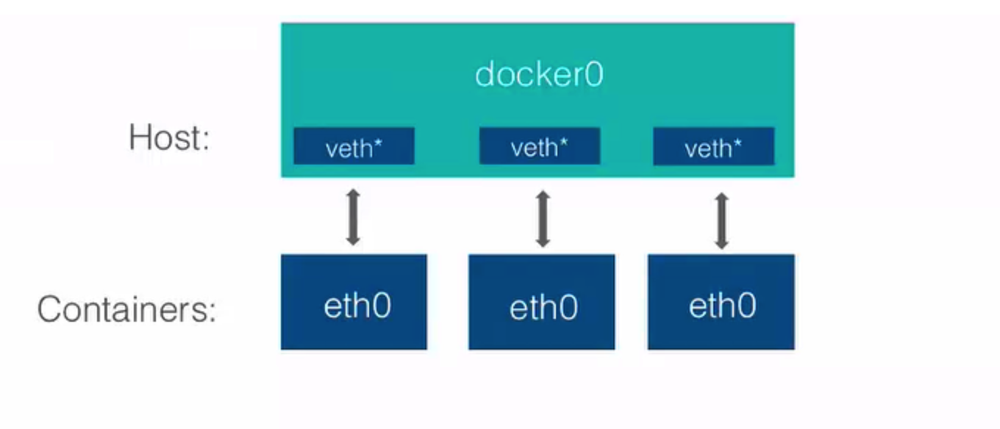
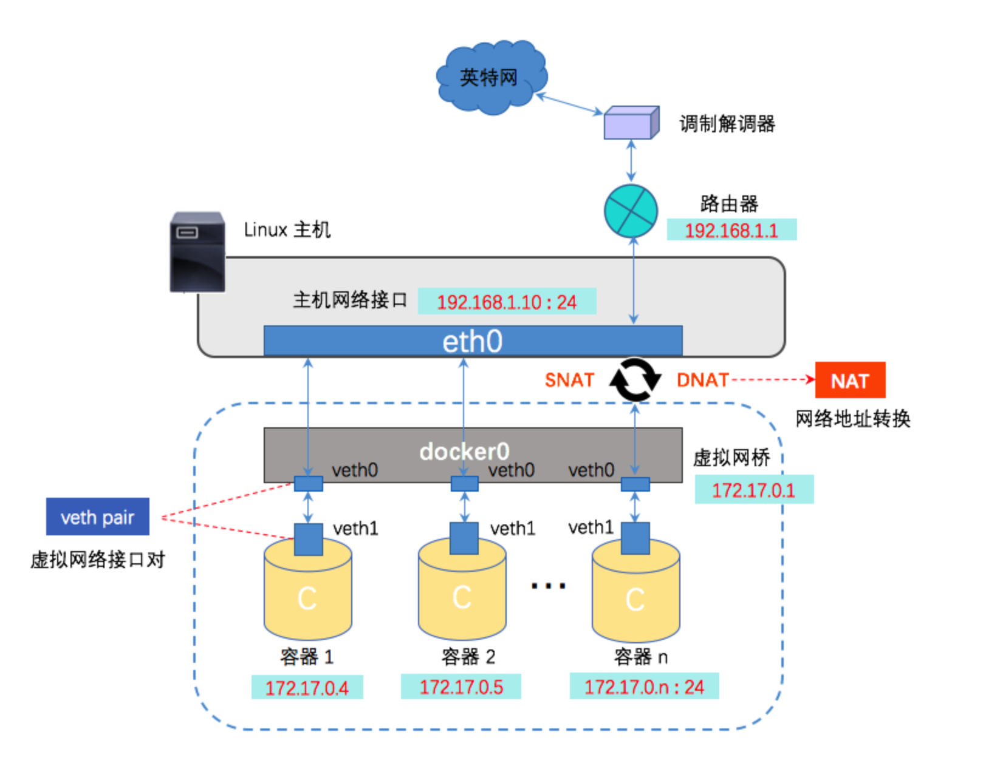

# docker bridge

## 列举当前docker有哪些网络

[root@centos7001 ~]# docker network ls
NETWORK ID          NAME                DRIVER              SCOPE
d77d0ea51ceb        bridge              bridge              local
8e3f61f804ec        host                host                local
cb901b049794        none                null                local


## 启动一个容器

[root@centos7001 ~]# docker run -d --name test1 busybox /bin/sh -c "while true; do sleep 3600; done"
1f4f3d6f0749a0b8de586bc556df68c155beb25fb166b3ebb936aeffd421d3ce


## 查看哪些网络连接到bridge上

[root@centos7001 ~]# docker network inspect d77d0ea51ceb

```json
[
    {
        "Name": "bridge",
        "Id": "d77d0ea51ceb2d175e40d6fb8450b1a4098e1e1369b666c4fc0a55b35d7d7c73",
        "Created": "2019-10-30T05:12:38.343897247-07:00",
        "Scope": "local",
        "Driver": "bridge",
        "EnableIPv6": false,
        "IPAM": {
            "Driver": "default",
            "Options": null,
            "Config": [
                {
                    "Subnet": "172.17.0.0/16",
                    "Gateway": "172.17.0.1"
                }
            ]
        },
        "Internal": false,
        "Attachable": false,
        "Ingress": false,
        "ConfigFrom": {
            "Network": ""
        },
        "ConfigOnly": false,
        "Containers": {
            "1f4f3d6f0749a0b8de586bc556df68c155beb25fb166b3ebb936aeffd421d3ce": {
                "Name": "test1",
                "EndpointID": "5c033b2e5691098de20fffc58e7a68be53a57883f23ff42979256500bf66b14f",
                "MacAddress": "02:42:ac:11:00:02",
                "IPv4Address": "172.17.0.2/16",
                "IPv6Address": ""
            }
        },
        "Options": {
            "com.docker.network.bridge.default_bridge": "true",
            "com.docker.network.bridge.enable_icc": "true",
            "com.docker.network.bridge.enable_ip_masquerade": "true",
            "com.docker.network.bridge.host_binding_ipv4": "0.0.0.0",
            "com.docker.network.bridge.name": "docker0",
            "com.docker.network.driver.mtu": "1500"
        },
        "Labels": {}
    }
]
```

结论: containerID 为1f4f3d6f0749a0b8de586bc556df68c155beb25fb166b3ebb936aeffd421d3ce，名字为test1的container连接到了bridge,IPv4Address为172.17.0.2，MacAddress为02:42:ac:11:00:02

```text
"Containers": {
            "1f4f3d6f0749a0b8de586bc556df68c155beb25fb166b3ebb936aeffd421d3ce": {
                "Name": "test1",
                "EndpointID": "5c033b2e5691098de20fffc58e7a68be53a57883f23ff42979256500bf66b14f",
                "MacAddress": "02:42:ac:11:00:02",
                "IPv4Address": "172.17.0.2/16",
                "IPv6Address": ""
            }
        }
```


## 查看当前centos的网络接口

[root@centos7001 ~]# ip a
1: lo: <LOOPBACK,UP,LOWER_UP> mtu 65536 qdisc noqueue state UNKNOWN group default 
    link/loopback 00:00:00:00:00:00 brd 00:00:00:00:00:00
    inet 127.0.0.1/8 scope host lo
       valid_lft forever preferred_lft forever
    inet6 ::1/128 scope host 
       valid_lft forever preferred_lft forever
2: eno16777736: <BROADCAST,MULTICAST,UP,LOWER_UP> mtu 1500 qdisc pfifo_fast state UP group default qlen 1000
    link/ether 00:0c:29:dd:52:8b brd ff:ff:ff:ff:ff:ff
    inet 172.16.229.155/24 brd 172.16.229.255 scope global noprefixroute dynamic eno16777736
       valid_lft 1614sec preferred_lft 1614sec
    inet6 fe80::20c:29ff:fedd:528b/64 scope link noprefixroute 
       valid_lft forever preferred_lft forever
3: virbr0: <NO-CARRIER,BROADCAST,MULTICAST,UP> mtu 1500 qdisc noqueue state DOWN group default 
    link/ether 52:54:00:4f:f2:fa brd ff:ff:ff:ff:ff:ff
    inet 192.168.122.1/24 brd 192.168.122.255 scope global virbr0
       valid_lft forever preferred_lft forever
4: virbr0-nic: <BROADCAST,MULTICAST> mtu 1500 qdisc pfifo_fast master virbr0 state DOWN group default qlen 500
    link/ether 52:54:00:4f:f2:fa brd ff:ff:ff:ff:ff:ff
5: docker0: <BROADCAST,MULTICAST,UP,LOWER_UP> mtu 1500 qdisc noqueue state UP group default 
    link/ether 02:42:f8:4b:56:2e brd ff:ff:ff:ff:ff:ff
    inet 172.17.0.1/16 brd 172.17.255.255 scope global docker0
       valid_lft forever preferred_lft forever
    inet6 fe80::42:f8ff:fe4b:562e/64 scope link 
       valid_lft forever preferred_lft forever
7: vetha2cbc54: <BROADCAST,MULTICAST,UP,LOWER_UP> mtu 1500 qdisc noqueue master docker0 state UP group default 
    link/ether 6a:00:97:0b:c5:34 brd ff:ff:ff:ff:ff:ff
    inet6 fe80::6800:97ff:fe0b:c534/64 scope link 
       valid_lft forever preferred_lft forever

注意：docker0是本机的network namespace,test1 container有自己的namespace

docker0和test1 container自己的namespace连在一起需要一对veth pair.




## test1的namespace网络接口

[root@centos7001 ~]# docker exec test1 ip a
1: lo: <LOOPBACK,UP,LOWER_UP> mtu 65536 qdisc noqueue 
    link/loopback 00:00:00:00:00:00 brd 00:00:00:00:00:00
    inet 127.0.0.1/8 scope host lo
       valid_lft forever preferred_lft forever
6: eth0: <BROADCAST,MULTICAST,UP,LOWER_UP> mtu 1500 qdisc noqueue 
    link/ether 02:42:ac:11:00:02 brd ff:ff:ff:ff:ff:ff
    inet 172.17.0.2/16 brd 172.17.255.255 scope global eth0
       valid_lft forever preferred_lft forever


结论：

```text
test1 container的eth0和centos的vetha2cbc54是一对
```


## 验证brctl

安装工具brctl:
[root@centos7001 ~]# yum install bridge-utils


[root@centos7001 ~]# brctl show
bridge name     bridge id               STP enabled     interfaces
docker0         8000.0242f84b562e       no              vetha2cbc54
virbr0          8000.5254004ff2fa       yes             virbr0-nic

docker0有一个接口vetha2cbc54


再创建一个容器,新增vethf12466f
[root@centos7001 ~]# docker run -d --name test2 busybox /bin/sh -c "while true; do sleep 3600; done"
fc5902cb8f5bd6c316339abb157410d1daedc512164ec77decfffaa851c43b68

观察新增的网络接口
[root@centos7001 ~]# ip a
1: lo: <LOOPBACK,UP,LOWER_UP> mtu 65536 qdisc noqueue state UNKNOWN group default 
    link/loopback 00:00:00:00:00:00 brd 00:00:00:00:00:00
    inet 127.0.0.1/8 scope host lo
       valid_lft forever preferred_lft forever
    inet6 ::1/128 scope host 
       valid_lft forever preferred_lft forever
2: eno16777736: <BROADCAST,MULTICAST,UP,LOWER_UP> mtu 1500 qdisc pfifo_fast state UP group default qlen 1000
    link/ether 00:0c:29:dd:52:8b brd ff:ff:ff:ff:ff:ff
    inet 172.16.229.155/24 brd 172.16.229.255 scope global noprefixroute dynamic eno16777736
       valid_lft 1196sec preferred_lft 1196sec
    inet6 fe80::20c:29ff:fedd:528b/64 scope link noprefixroute 
       valid_lft forever preferred_lft forever
3: virbr0: <NO-CARRIER,BROADCAST,MULTICAST,UP> mtu 1500 qdisc noqueue state DOWN group default 
    link/ether 52:54:00:4f:f2:fa brd ff:ff:ff:ff:ff:ff
    inet 192.168.122.1/24 brd 192.168.122.255 scope global virbr0
       valid_lft forever preferred_lft forever
4: virbr0-nic: <BROADCAST,MULTICAST> mtu 1500 qdisc pfifo_fast master virbr0 state DOWN group default qlen 500
    link/ether 52:54:00:4f:f2:fa brd ff:ff:ff:ff:ff:ff
5: docker0: <BROADCAST,MULTICAST,UP,LOWER_UP> mtu 1500 qdisc noqueue state UP group default 
    link/ether 02:42:f8:4b:56:2e brd ff:ff:ff:ff:ff:ff
    inet 172.17.0.1/16 brd 172.17.255.255 scope global docker0
       valid_lft forever preferred_lft forever
    inet6 fe80::42:f8ff:fe4b:562e/64 scope link 
       valid_lft forever preferred_lft forever
7: vetha2cbc54: <BROADCAST,MULTICAST,UP,LOWER_UP> mtu 1500 qdisc noqueue master docker0 state UP group default 
    link/ether 6a:00:97:0b:c5:34 brd ff:ff:ff:ff:ff:ff
    inet6 fe80::6800:97ff:fe0b:c534/64 scope link 
       valid_lft forever preferred_lft forever
9: vethf12466f: <BROADCAST,MULTICAST,UP,LOWER_UP> mtu 1500 qdisc noqueue master docker0 state UP group default 
    link/ether 42:6b:d8:c6:78:08 brd ff:ff:ff:ff:ff:ff
    inet6 fe80::406b:d8ff:fec6:7808/64 scope link 
       valid_lft forever preferred_lft forever


docker0多了一个网络接口
[root@centos7001 ~]# brctl show
bridge name     bridge id               STP enabled     interfaces
docker0         8000.0242f84b562e       no              vetha2cbc54
                                                                                 vethf12466f
virbr0          8000.5254004ff2fa       yes                 virbr0-nic


进入test2：
[root@centos7001 ~]# docker exec test2 ip a
1: lo: <LOOPBACK,UP,LOWER_UP> mtu 65536 qdisc noqueue 
    link/loopback 00:00:00:00:00:00 brd 00:00:00:00:00:00
    inet 127.0.0.1/8 scope host lo
       valid_lft forever preferred_lft forever
8: eth0: <BROADCAST,MULTICAST,UP,LOWER_UP> mtu 1500 qdisc noqueue 
    link/ether 02:42:ac:11:00:03 brd ff:ff:ff:ff:ff:ff
    inet 172.17.0.3/16 brd 172.17.255.255 scope global eth0
       valid_lft forever preferred_lft forever

验证结论：vethf12466f和container的eth0成对出现


## 单个容器访问外网




容器通过连接到docker0后做了一个nat地址转换