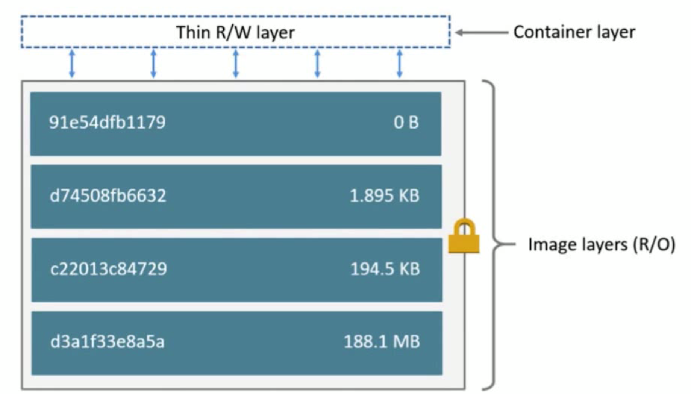
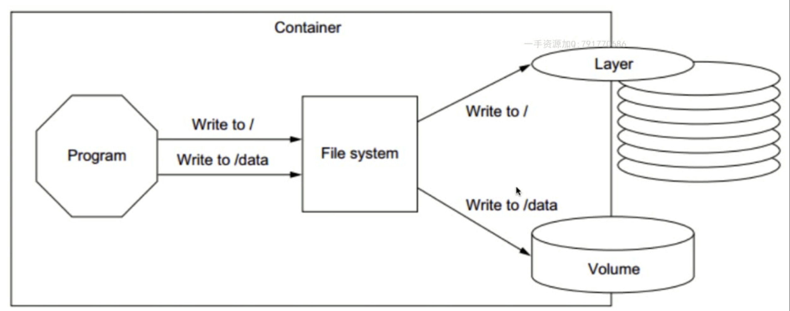

# docker的持久化存储和数据共享

每一层的image都是不可变的，只有最上层的container可以改变。一旦容器删除，容器里的数据将会消失。如果创建了一个和数据库相关的容器，总要数据丢失了，是不可接受的。

container里的程序，默认情况写文件都是些到container里面，但是我们可以通过一个机制吧数据mount到物理机器上

两种方式：
1.本地物理机器volume
2.plugin远程存储

1.本地物理机器volume，有两种类型：

​	受管理的volume，由docker后台自动创建
​	绑定挂载的volume，具体挂载的位置可又由用户自己指定

