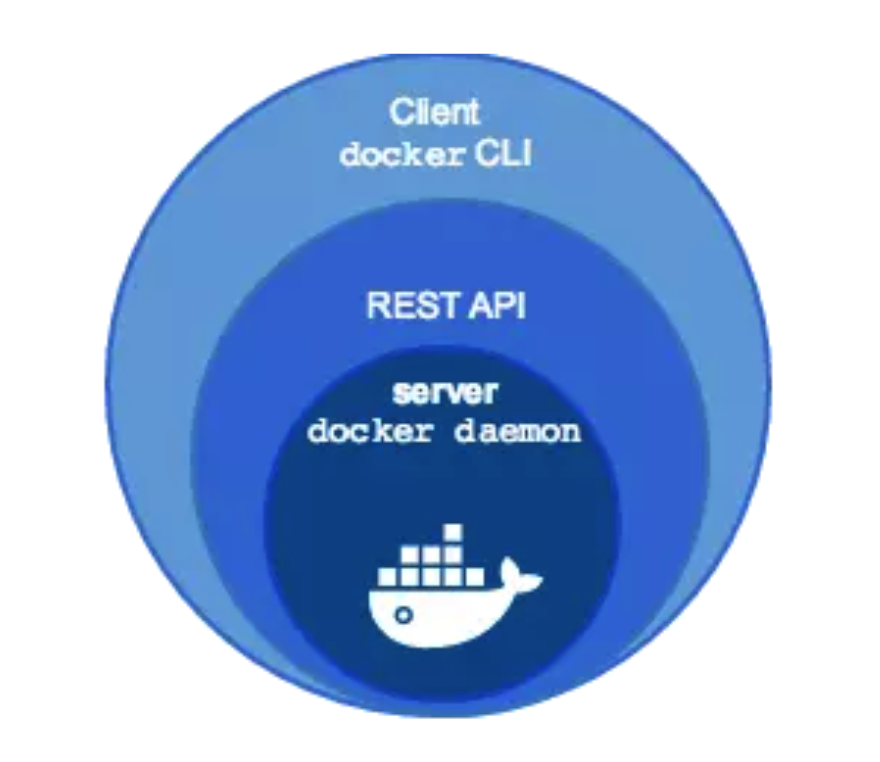
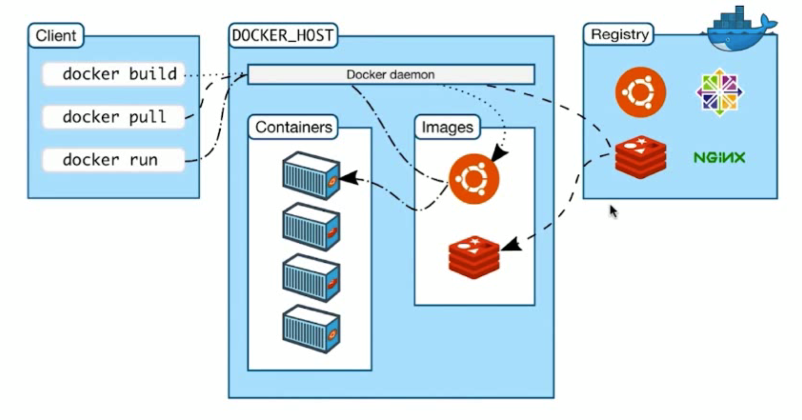

# docker架构

## 1 Docker Engine

Docker Engine也就是“Docker”，Docker我们一般理解的，都是C/S模型，用户通过docker client向docker daemon发送REST 请求。
 Docker Engine包括这么几个部分：

- Docker Daemon — docker 的守护进程，属于C/S中的server[ docker daemon]

- Docker REST API — docker daemon向外暴露的REST 接口

- Docker CLI — docker向外暴露的命令行接口（Command Line API）

  

因此，客户端访问服务端的方式有两种

- 一种是使用命令行工具，比如docker run， docker ps....
- 另一种就是直接通过调用REST API，比如发送一个curl http请求

**备注：curl**
 curl可以帮你完成你所有在浏览器上的操作，比如登录(这就是传输数据)，下载文件，上传文件等等功能

https://www.jianshu.com/p/20b6dce82b11来源：简书著作权归作者所有。商业转载请联系作者获得授权，非商业转载请注明出处。

## 2整体架构图

[root@centos7001 ~]# docker version
Client: Docker Engine - Community
 Version:           19.03.4
 API version:       1.40
 Go version:        go1.12.10
 Git commit:        9013bf583a
 Built:             Fri Oct 18 15:52:22 2019
 OS/Arch:           linux/amd64
 Experimental:      false

Server: Docker Engine - Community
 Engine:
  Version:          19.03.4
  API version:      1.40 (minimum version 1.12)
  Go version:       go1.12.10
  Git commit:       9013bf583a
  Built:            Fri Oct 18 15:50:54 2019
  OS/Arch:          linux/amd64
  Experimental:     false
 containerd:
  Version:          1.2.10
  GitCommit:        b34a5c8af56e510852c35414db4c1f4fa6172339
 runc:
  Version:          1.0.0-rc8+dev
  GitCommit:        3e425f80a8c931f88e6d94a8c831b9d5aa481657
 docker-init:
  Version:          0.18.0
  GitCommit:        fec3683

## 3.技术实现

Namespace: 隔离技术，pid，net,  idc, mnt, uts

Controller Groups: 做资源限制

union file system: container 和 image 的分层

