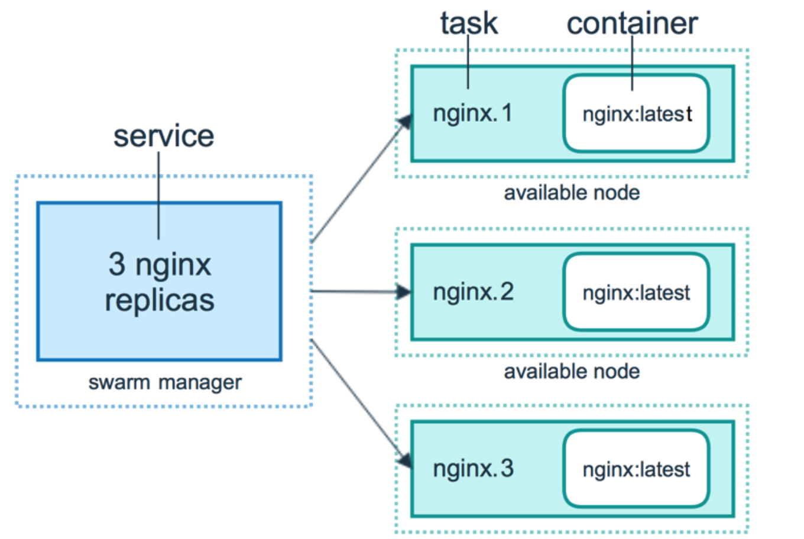
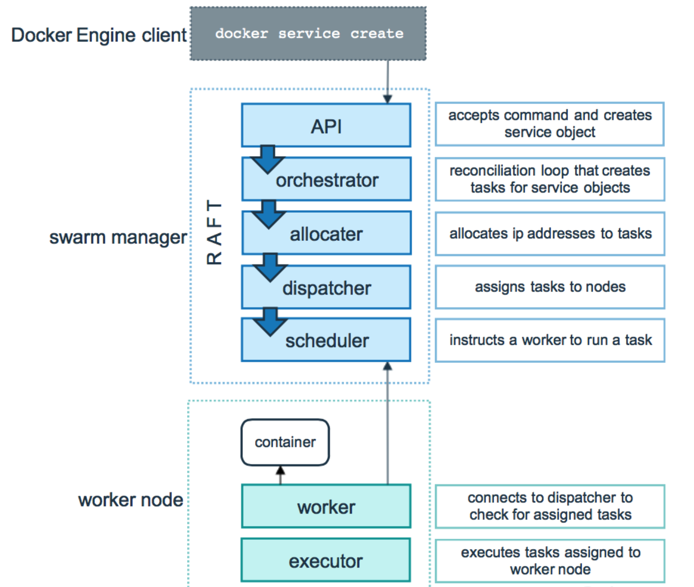

# 容器编排Swarm介绍

之前的对操作都是针对一台主机上的，真是环境都是在分布式集群上的
我们需要一个容器编排的工具，这个工具在docker里面提供了swarm工具

Swram是Docker公司推出的官方容器集群平台，基于go语言实现，代码开源在 https://github.com/docker/swarm .2016年2月对架构进行重新设计，推出了v2版本，支持超过1千个节点。作为容器集群管理器，Swarm最大的优势之一就是100%支持标准的Docker API及工具（如Compose，docker-py等），Docker本身就可以很好地与Swarm进行集成。

## swarm架构

swarm有两个角色，Manager，Worker

Manager：
manager是集群的大脑，为了避免单点故障，manager会做集群，集群就设计状态的同步。一个manager产生的数据怎么同步到另一个manager。

Worder:
干活的节点，节点比较多，也需要做数据同步

## 重要的概念

Service和Replicas
Service相当于一个容器
Replicas做横向扩展

服务，任务，容器

swarm调度过程

