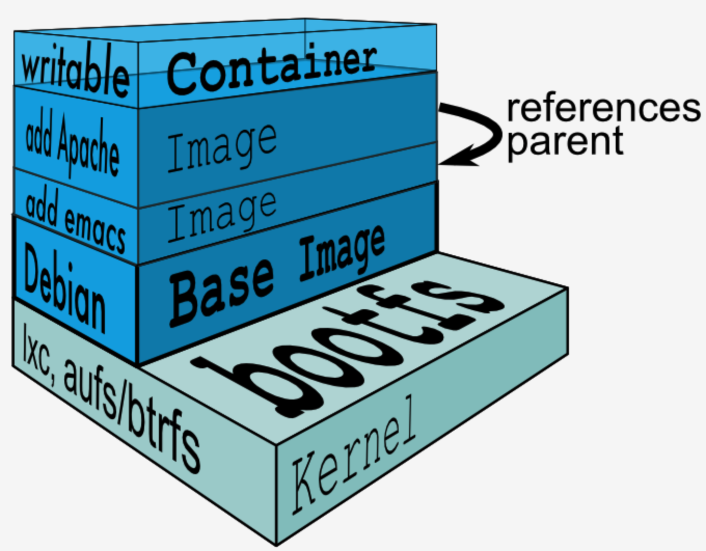

# image

## 1.什么是image

文件和meta data的集合（root filesystem）

分层的文件系统，docker pull image 的时候可以看出是分层下载的，镜像的每一层都对应着一个Dockerfile文件,不同的image可以共享相同的layer


**查看镜像分层 **

```
[root@centos7001 docker]# docker history redis:latest 
IMAGE               CREATED             CREATED BY                                      SIZE                COMMENT
de25a81a5a0b        3 weeks ago         /bin/sh -c #(nop)  CMD ["redis-server"]         0B                  
<missing>           3 weeks ago         /bin/sh -c #(nop)  EXPOSE 6379                  0B                  
<missing>           3 weeks ago         /bin/sh -c #(nop)  ENTRYPOINT ["docker-entry  0B                  
<missing>           3 weeks ago         /bin/sh -c #(nop) COPY file:df205a0ef6e6df89  374B                
<missing>           3 weeks ago         /bin/sh -c #(nop) WORKDIR /data                 0B                  
<missing>           3 weeks ago         /bin/sh -c #(nop)  VOLUME [/data]               0B                  
<missing>           3 weeks ago         /bin/sh -c mkdir /data && chown redis:redis   0B                  
<missing>           3 weeks ago         /bin/sh -c set -eux;   savedAptMark="$(apt-m  24.6MB              
<missing>           3 weeks ago         /bin/sh -c #(nop)  ENV REDIS_DOWNLOAD_SHA=66  0B                  
<missing>           3 weeks ago         /bin/sh -c #(nop)  ENV REDIS_DOWNLOAD_URL=ht  0B                  
<missing>           3 weeks ago         /bin/sh -c #(nop)  ENV REDIS_VERSION=5.0.6      0B                  
<missing>           3 weeks ago         /bin/sh -c set -eux;  savedAptMark="$(apt-ma  4.04MB              
<missing>           3 weeks ago         /bin/sh -c #(nop)  ENV GOSU_VERSION=1.11        0B                  
<missing>           3 weeks ago         /bin/sh -c groupadd -r -g 999 redis && usera  329kB               
<missing>           3 weeks ago         /bin/sh -c #(nop)  CMD ["bash"]                 0B                  
<missing>           3 weeks ago         /bin/sh -c #(nop) ADD file:74b2987cacab5a6b0  69.2MB  
```


**docker 安装目录存放数据的目录，镜像,容器，网络等就存储在这里**

[root@centos7001 docker]# ls /var/lib/docker
builder  buildkit  containers  devicemapper  image  network  plugins  runtimes  swarm  tmp  trust  volumes 


这里是创建的容器，里面包括容器的日志，配置，网络等信息
[root@centos7001 docker]# ls /var/lib/docker/containers/
2fffa3831cd6c7e9cea3821034de6406d89cb592a76feacb68b983742bdfc6c1

[root@centos7001 docker]# ls /var/lib/docker/containers/2fffa3831cd6c7e9cea3821034de6406d89cb592a76feacb68b983742bdfc6c1/
2fffa3831cd6c7e9cea3821034de6406d89cb592a76feacb68b983742bdfc6c1-json.log
checkpoints/
config.v2.json
hostconfig.json
hostname
hosts
mounts/
resolv.conf
resolv.conf.hash

## 2.docker image实现原理

典型的 Linux 在启动后，首先将 rootfs 置为 readonly，进行一系列检查, 然后将其切换为 "readwrite" 供用户使用。

在 Docker 中，起初也是将 rootfs 以 readonly 方式加载并检查，然而接下来利用 union mount 将一个 readwrite 文件系统挂载在 readonly 的 rootfs 之上，并且允许再次将下层的 file system 设定为 readonly，并且向上叠加。

这样一组 readonly 和一个 writeable 的结构构成一个 container 的运行目录，每一个被称作一个 Layer。如下图：



**思考**
创建一个container，进入container修改A文件并保存，出来再次创建相同的container并进入A文件类容是修改过的吗？

新建的container的A文件并没有发生变化。修改文件会从下层的image拷贝到container可写层，再次创建的container会引用下层的相同image，image是不可变的。并且如果一个container所占空间为100M，3个相同的容器所占空间依然是100M,因为这是引用下层的相同image。

**增量式版本控制**
**磁盘占用小**


## 3.查看当前的image

[root@centos7001 ~]# docker image ls
REPOSITORY          TAG                 IMAGE ID            CREATED             SIZE
hello-world         latest              fce289e99eb9        9 months ago        1.84kB


## 4.docker image获取

1: docker pull imageName

2: dockerfile


## 5.构建第一个自己的镜像

history | grep yum

— 编译C 语言需要安装如下库
yum install gcc
yum install glibc-static


vim hello-wordc.c 

```c
#include<stdio.h>
int main()
{
printf("hello docker\n");
}
```


 将源文件编译成目标文件
[root@centos7001 hello-world]# gcc  -static hello-world.c -o hello


执行可执行文件
[root@centos7001 hello-world]# ./hello 
hello docker


[root@centos7001 hello-worldc]# vim Dockerfile
FROM scratch
ADD hello /
CMD ["/hello"]


[root@centos7001 hello-world]# docker build -t xupan/hello-world .
Sending build context to Docker daemon  864.8kB
Step 1/3 : FROM scratch
 ---> 
Step 2/3 : ADD hello /
 ---> 58da3cf4b8fc
Step 3/3 : CMD ["/hello"]
 ---> Running in 51be64b7b925
Removing intermediate container 51be64b7b925
 ---> 22878ce4fd12
Successfully built 22878ce4fd12
Successfully tagged xupan/hello-world:latest


[root@centos7001 hello-world]# docker image ls
REPOSITORY          TAG                 IMAGE ID            CREATED             SIZE
xupan/hello-world   latest              22878ce4fd12        26 seconds ago      861kB
hello-world         latest              fce289e99eb9        9 months ago        1.84kB


[root@centos7001 hello-world]# docker history 22878ce4fd12
IMAGE               CREATED             CREATED BY                                      SIZE                COMMENT
22878ce4fd12        2 minutes ago       /bin/sh -c #(nop)  CMD ["/hello"]               0B                  
58da3cf4b8fc        2 minutes ago       /bin/sh -c #(nop) ADD file:d9faf38ea9495d85c  861kB    


[root@centos7001 hello-world]# docker run xupan/hello-world
hello docker


## 6.删除镜像

docker image rm imageID


## 7.配置镜像加速器

[root@centos7001 docker]# pwd
/etc/docker

[root@centos7001 docker]# vim daemon.json  
{
        "registry-mirrors": ["https://hub-mirror.c.163.com"]
}

[root@centos7001 docker]# systemctl restart docker
**重新启动docker**

**查看docker 镜像加速器是否配置成功**

[root@centos7001 docker]# docker info
Client:
 Debug Mode: false

Server:
 Containers: 1
  Running: 0
  Paused: 0
  Stopped: 1
 Images: 49
 Server Version: 19.03.4
 Storage Driver: devicemapper
  Pool Name: docker-8:3-203114320-pool
  Pool Blocksize: 65.54kB
  Base Device Size: 10.74GB
  Backing Filesystem: xfs
  Udev Sync Supported: true
  Data file: /dev/loop0
  Metadata file: /dev/loop1
  Data loop file: /var/lib/docker/devicemapper/devicemapper/data
  Metadata loop file: /var/lib/docker/devicemapper/devicemapper/metadata
  Data Space Used: 3.273GB
  Data Space Total: 107.4GB
  Data Space Available: 39.2GB
  Metadata Space Used: 6.205MB
  Metadata Space Total: 2.147GB
  Metadata Space Available: 2.141GB
  Thin Pool Minimum Free Space: 10.74GB
  Deferred Removal Enabled: true
  Deferred Deletion Enabled: true
  Deferred Deleted Device Count: 0
  Library Version: 1.02.158-RHEL7 (2019-05-13)
 Logging Driver: json-file
 Cgroup Driver: cgroupfs
 Plugins:
  Volume: local
  Network: bridge host ipvlan macvlan null overlay
  Log: awslogs fluentd gcplogs gelf journald json-file local logentries splunk syslog
 Swarm: active
  NodeID: wtcebzs8jcwdz5fe9mwem9sxc
  Is Manager: true
  ClusterID: 28yivz5v5ja6xfb1ylm00gskh
  Managers: 1
  Nodes: 3
  Default Address Pool: 10.0.0.0/8  
  SubnetSize: 24
  Data Path Port: 4789
  Orchestration:
   Task History Retention Limit: 5
  Raft:
   Snapshot Interval: 10000
   Number of Old Snapshots to Retain: 0
   Heartbeat Tick: 1
   Election Tick: 10
  Dispatcher:
   Heartbeat Period: 5 seconds
  CA Configuration:
   Expiry Duration: 3 months
   Force Rotate: 0
  Autolock Managers: false
  Root Rotation In Progress: false
  Node Address: 172.16.229.155
  Manager Addresses:
   172.16.229.155:2377
 Runtimes: runc
 Default Runtime: runc
 Init Binary: docker-init
 containerd version: b34a5c8af56e510852c35414db4c1f4fa6172339
 runc version: 3e425f80a8c931f88e6d94a8c831b9d5aa481657
 init version: fec3683
 Security Options:
  seccomp
   Profile: default
 Kernel Version: 3.10.0-229.el7.x86_64
 Operating System: CentOS Linux 7 (Core)
 OSType: linux
 Architecture: x86_64
 CPUs: 4
 Total Memory: 1.784GiB
 Name: centos7001
 ID: 2UXL:KFUA:YHK6:Y5PA:SAGN:ZLGM:JJP3:EJ2R:RUTL:PBVI:OQBC:FUGU
 Docker Root Dir: /var/lib/docker
 Debug Mode: false
 Registry: https://index.docker.io/v1/
 Labels:
 Experimental: false
 Insecure Registries:
  127.0.0.0/8
 Registry Mirrors:
  https://hub-mirror.c.163.com/
 Live Restore Enabled: false


**devicemapper: docker 的存储驱动**


[root@centos7001 devicemapper]# docker search

```
"docker search" requires exactly 1 argument.
See 'docker search --help'.

Usage:  docker search [OPTIONS] TERM

Search the Docker Hub for images
[root@centos7001 devicemapper]# docker search redis
NAME                             DESCRIPTION                                     STARS               OFFICIAL            AUTOMATED
redis                            Redis is an open source key-value store that  7500                [OK]                
bitnami/redis                    Bitnami Redis Docker Image                      130                                     [OK]
sameersbn/redis                                                                  78                                      [OK]
grokzen/redis-cluster            Redis cluster 3.0, 3.2, 4.0 & 5.0               62                                      
rediscommander/redis-commander   Alpine image for redis-commander - Redis man  31                                      [OK]
kubeguide/redis-master           redis-master with "Hello World!"                30                                      
redislabs/redis                  Clustered in-memory database engine compatib  24                                      
oliver006/redis_exporter          Prometheus Exporter for Redis Metrics. Supp  18                                      
arm32v7/redis                    Redis is an open source key-value store that  17                                      
redislabs/redisearch             Redis With the RedisSearch module pre-loaded  17                                      
webhippie/redis                  Docker images for Redis                         10                                      [OK]
s7anley/redis-sentinel-docker    Redis Sentinel                                  9                                       [OK]
insready/redis-stat              Docker image for the real-time Redis monitor  9                                       [OK]
redislabs/redisgraph             A graph database module for Redis               8                                       [OK]
bitnami/redis-sentinel           Bitnami Docker Image for Redis Sentinel         8                                       [OK]
arm64v8/redis                    Redis is an open source key-value store that  6                                       
redislabs/redismod               An automated build of redismod - latest Redi  5                                       [OK]
centos/redis-32-centos7          Redis in-memory data structure store, used a  4                                       
circleci/redis                   CircleCI images for Redis                       2                                       [OK]
frodenas/redis                   A Docker Image for Redis                        2                                       [OK]
tiredofit/redis                  Redis Server w/ Zabbix monitoring and S6 Ove  1                                       [OK]
runnable/redis-stunnel           stunnel to redis provided by linking contain  1                                       [OK]
wodby/redis                      Redis container image with orchestration        1                                       [OK]
cflondonservices/redis           Docker image for running redis                  0                                       
xetamus/redis-resource           forked redis-resource                           0                                       [OK]
```


## 8.save/镜像

docker image save redis:latest > redis.tar


## 9.load

docker image load < redis.tar