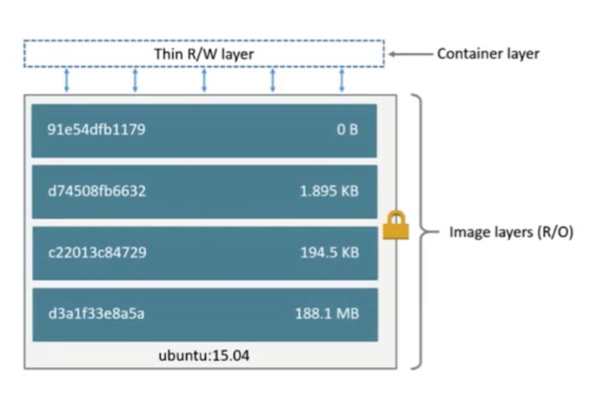

# container

## 1.什么是container

1.通过image创建

2.在image layer之上建立一个container layer（可读写）

3.类似：类和实例

4.Image负责App的存储和分发，Container负责运行App




## 2.列举当前所有容器，包括正在运行的和退出的

[root@centos7001 hello-world]# docker container ls -a
CONTAINER ID        IMAGE               COMMAND             CREATED             STATUS                       PORTS               NAMES
88f6d02ffb70        xupan/hello-world   "/hello"            20 minutes ago      Exited (13) 20 minutes ago                       adoring_lumiere
f52dafd6bc60        hello-world         "/hello"            54 minutes ago      Exited (0) 54 minutes ago                        strange_pasteur
3c5bd8edc37b        hello-world         "/hello"            2 days ago          Exited (0) 2 days ago                            heuristic_galileo


## 3.列举当前正在运行的容器

[root@centos7001 hello-world]# docker container ls 
CONTAINER ID        IMAGE               COMMAND             CREATED             STATUS              PORTS               NAMES

— hello-world 并不是常驻内存的进程，运行完成后就退出了

###对比：

docker pull centos:latest
docker run centos

[root@centos7001 hello-world]# docker container ls 
CONTAINER ID        IMAGE               COMMAND             CREATED             STATUS              PORTS               NAMES


[root@centos7001 hello-world]# docker container ls -a
CONTAINER ID        IMAGE               COMMAND             CREATED             STATUS                         PORTS               NAMES
13574a731245        centos              "/bin/bash"         2 minutes ago       Exited (0) 2 minutes ago                           dreamy_blackwell
88f6d02ffb70        xupan/hello-world   "/hello"            35 minutes ago      Exited (13) 35 minutes ago                         adoring_lumiere
f52dafd6bc60        hello-world         "/hello"            About an hour ago   Exited (0) About an hour ago                       strange_pasteur
3c5bd8edc37b        hello-world         "/hello"            2 days ago          Exited (0) 2 days ago                              heuristic_galileo

这里可以看出运行 command /hello 和 /bin/hash都会退出，两者都不是常驻内存的进程. statue是Exited


4.交互式运行容器

加入：-it

docker run -it centos

运行docker run -it centos后进入容器内部进行交互, container既然是在image之上的可读写的layer，那么我们就可以进入container后做新建文件，删除文件，yum install 等操作

[root@centos7001 hello-world]# docker run -it centos
[root@b7035a402f5b /]# 


新打开一个终端：

```text
[root@centos7001 ~]# docker container ls
CONTAINER ID        IMAGE               COMMAND             CREATED              STATUS              PORTS               NAMES
b7035a402f5b        centos              "/bin/bash"         About a minute ago   Up About a minute                       inspiring_roentge
```

这个时候STATUS变成了Up


## 删除所有container

[root@centos7001 ~]# docker container ls -aq
91b1194e2eab
e4be8b568b61
b3b1c8a47724
[root@centos7001 ~]# docker container rm $(docker container ls -aq)
91b1194e2eab
e4be8b568b61
b3b1c8a47724


对比

[root@centos7001 ~]# docker container ls -a | awk {'print$1'}
CONTAINER
886a1c6a41c7
7b247cdbb861