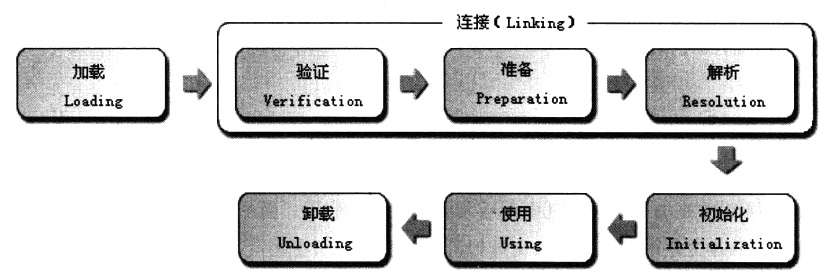

https://blog.csdn.net/u012998254/article/details/81635902


##class 生命周期：

````
加载->链接->初始化->使用->卸载

加载:
    1: 通过一个类的全限定名来获取其定义的二进制字节流
    2: 将这个字节流所代表的静态存储结构转化为方法区的运行时数据结构
    3: 在Java堆中生成一个代表这个类的java.lang.Class对象，作为对方法区中这些数据的访问入口

链接：
    1: 验证 class字节码文件格式是否正确，是否符合JVM规范
    2: 准备 class的静态变量赋值为默认值
    3: 解析 符号引用转化为直接引用
    

初始化：
    1：静态变量赋值为初始值或者对静态对象进行初始化->执行静态块->创建类的实例。
    
    
public class App {
    private static App app = new App();// preparation app = null  inititalization app = new App() ;  count = 1;
    private static int count = 2;      // preparation count = 0   inititalization count = 2

    public App(){
        count ++;
    }

    public static void main(String[] args) {
        System.out.println(count);  //结果为2
    }
}
    
    
    ---------------------------------------------------------------------------------
    
     package com.chong.studyparalell.clazz.loader;
    
    public class ClassLoaderDemo {
    public static void main(String []args){
    Test test2 = new Test();
    
    System.out.println("Test2实例化结束"+test2.toString());
    
    }
    }
    
    --------------------------------------------------------------------------------------
    
    package com.chong.studyparalell.clazz.loader;
    
    public class Test{
    
    private static Test test1 = new Test();
    private static int a = 2;
    private static int b = 2;
    
    static {
    System.out.println("【Test类静态块】a=" + a);
    }
    
    public Test(){
    
    System.out.println("【Test类构造方法】a=" + a);
    System.out.println("【Test类构造方法】b=" + b);
    System.out.println("【Test类实例】" + this.toString());
    }
    
    public static Test newInstance(){
    return test1;
    }
    }
    
    --------------------------------------------------------------------
    
    log输出如下：
    1 【Test类构造方法】a=0
    2 【Test类构造方法】b=0
    3 【Test类实例】com.chong.studyparalell.clazz.loader.Test@16c1857
    4 【Test类静态块】a=2
    5 【Test类构造方法】a=2
    6 【Test类构造方法】b=2
    7 【Test类实例】com.chong.studyparalell.clazz.loader.Test@1b1fd9c
    8 Test2实例化结束com.chong.studyparalell.clazz.loader.Test@1b1fd9c
    
    首先Test类在链接阶段（准备阶段），a，b分别被设置默认值0。
    当new Test()执行后，
    1）首先初始化Test类的三个静态变量 test1,a,b。
    初始化test1时，第一次调用构造方法，此时a,b为0。对应日志1,2行。
    实例化test1，日志第3行。
    test1初始化完成后，继续初始化a,b，设为2。
    接着初始化静态块 ，对应日志第4行。
    2）执行Test类的构造方法
    因为a,b已经被初始化为2，所以执行类的构造方法时，会输出a，b 为2。日志第5,6行。
    实例化后输出地址信息，日志第7行。
    3）最终main方法里打出实例工作完成，日志第8行。
    
````


