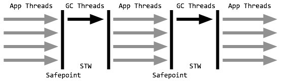
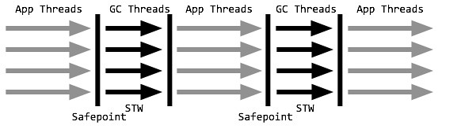
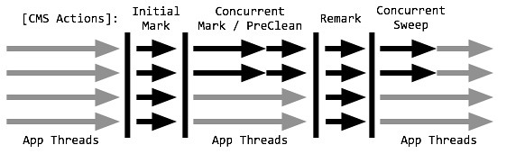

##GC

###串行收集器
   
   
    串行收集器组合 Serial + Serial Old
    开启选项：-XX:+SerialGC
    
    串行收集器是最基本、发展时间最长、久经考验的垃圾收集器，也是client模式下的默认收集器配置。
    
    串行收集器采用单线程stop-the-world的方式进行收集。当内存不足时，串行GC设置停顿标识，待所有线程都进入安全点(Safepoint)时，
    应用线程暂停，串行GC开始工作，采用单线程方式回收空间并整理内存。
    
    优点： 单线程也意味着复杂度更低、占用内存更少
    缺点： 但同时也意味着不能有效利用多核优势
    
    应用场景： 事实上，串行收集器特别适合堆内存不高、单核甚至双核CPU的场合。
   
    
###并行收集器
   
   
    关注吞吐量为目标
    
    并行收集器组合 Parallel Scavenge + Parallel Old
    开启选项：-XX:+UseParallelGC或-XX:+UseParallelOldGC(可互相激活)
    
    并行收集器是以关注吞吐量为目标的垃圾收集器，也是server模式下的默认收集器配置，
    对吞吐量的关注主要体现在年轻代Parallel Scavenge收集器上。
    
    并行收集器与串行收集器工作模式相似，都是stop-the-world方式，只是暂停时并行地进行垃圾收集。
    年轻代采用复制算法，老年代采用标记-整理，在回收的同时还会对内存进行压缩. 
    关注吞吐量主要指年轻代的Parallel Scavenge收集器，通过两个目标参数-XX:MaxGCPauseMills和-XX:GCTimeRatio，
    调整新生代空间大小，来降低GC触发的频率。并行收集器适合对吞吐量要求远远高于延迟要求的场景，并且在满足最差延时的情况下，
    并行收集器将提供最佳的吞吐量。

    
    
    
####并发标记清除收集器
   

    并发标记清除收集器组合 ParNew + CMS + Serial Old
    开启选项：-XX:+UseConcMarkSweepGC
    
    年轻代使用STW式的并行收集，年轻代ParNew与并行收集器类似
    老年代回收采用CMS进行垃圾回收，对延迟的关注也主要体现在老年代CMS上，老年代CMS每个收集周期都要经历：初始标记、并发标记、重新标记、并发清除。

    初始标记：以STW的方式标记所有的根对象
    并发标记：则同应用线程一起并行，标记出根对象的可达路径
    重新标记：行垃圾回收前，CMS再以一个STW进行重新标记，标记那些由应用线程修改而可能错过的可达对象
    最后得到的不可达对象将在并发清除阶段进行回收
    
    值得注意的是，初始标记和重新标记都已优化为多线程执行。CMS非常适合堆内存大、CPU核数多的服务器端应用，也是G1出现之前大型应用的首选收集器。
    
    
    但是CMS并不完美，它有以下缺点：
        由于并发进行，CMS在收集与应用线程会同时会增加对堆内存的占用，也就是说，CMS必须要在老年代堆内存用尽之前完成垃圾回收，否则CMS回收失败时，将触发担保机制，串行老年代收集器将会以STW的方式进行一次GC，从而造成较大停顿时间；
        标记清除算法无法整理空间碎片，老年代空间会随着应用时长被逐步耗尽，最后将不得不通过担保机制对堆内存进行压缩。CMS也提供了参数-XX:CMSFullGCsBeForeCompaction(默认0，即每次都进行内存整理)来指定多少次CMS收集之后，进行一次压缩的Full GC。
    

##以上3中垃圾收集器的共同特点：
```
之前介绍的几组垃圾收集器组合，都有几个共同点：

年轻代、老年代是独立且连续的内存块；
年轻代收集使用单eden、双survivor进行复制算法；
老年代收集必须扫描整个老年代区域；
都是以尽可能少而块地执行GC为设计原则。

```

####Garbage First
