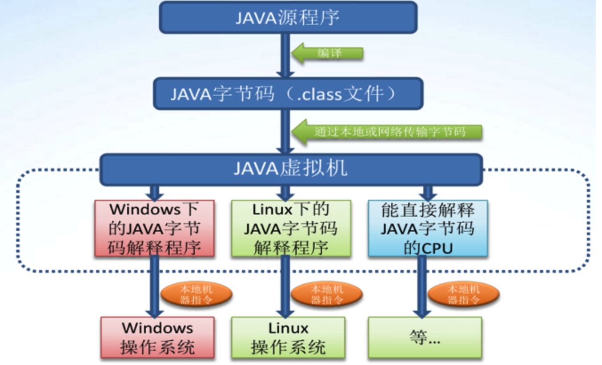

# jvm

​	jvm是整个java平台的基石，是java技术实现和**硬件无关操作系统无关**的关键部分，是java语言生成出极小体积的**编译代码的运行平台**(class文件的运行平台)，是避免用户机器避免恶意代码损害的屏障。如同真实的计算机一样，他有自己的指令集和运行时数据区。

​	jvm和java语言并没有必然的联系，他只与具有特定文件格式的二进制文件的class文件格式有所关联。class文件包含了java虚拟机的指令集等

