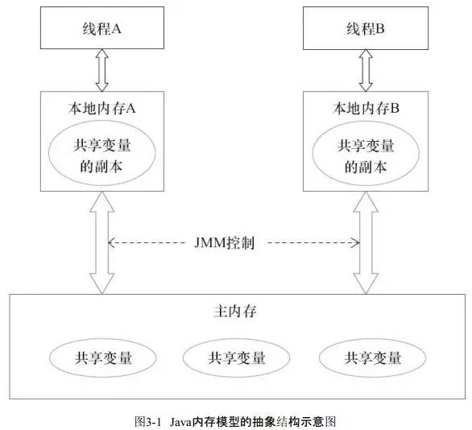

#java 内存模型



####带高速缓存CPU的执行过程
```text
1.程序以及数据被加载到主内存
2.指令和数据被加载到CPU高速缓存
3.CPU执行指令，并且把数据回写入到CPU高速缓存
4.CPU高速缓存中的数据回写到主内存
```


#### Java 内存模型对主内存与工作内存之间的具体交互协议定义了八种操作
```text
lock（锁定）：作用于主内存变量，把一个变量标识为一条线程独占状态。
unlock（解锁）：作用于主内存变量，把一个处于锁定状态的变量释放出来，释放后的变量才可以被其他线程锁定。
read（读取）：作用于主内存变量，把一个变量从主内存传输到线程的工作内存中，以便随后的 load 动作使用。
load（载入）：作用于工作内存变量，把 read 操作从主内存中得到的变量值放入工作内存的变量副本中。
use（使用）：作用于工作内存变量，把工作内存中的一个变量值传递给执行引擎，每当虚拟机遇到一个需要使用变量值的字节码指令时执行此操作。
assign（赋值）：作用于工作内存变量，把一个从执行引擎接收的值赋值给工作内存的变量，每当虚拟机遇到一个需要给变量进行赋值的字节码指令时执行此操作。
store（存储）：作用于工作内存变量，把工作内存中一个变量的值传递到主内存中，以便后续 write 操作。
write（写入）：作用于主内存变量，把 store 操作从工作内存中得到的值放入主内存变量中。
```


```java

package com.xp.demo.thread;

public class JMMDemo {

    public static boolean initFlag = false;

    public static void refresh() {
        System.out.println("refresh data...");
        initFlag = true;
        System.out.println("refresh data success...");
    }

    public static void loadData() {
        while (!initFlag) {

        }
        String threadName = Thread.currentThread().getName();

        System.out.println(threadName);
        System.out.println("当前线程" + threadName + "嗅探到 initFlag 的值改变为：" + initFlag);
    }

    public static void main(String[] args) throws InterruptedException {
        Thread thread1 = new Thread(() -> { loadData(); });
        Thread thread2 = new Thread(() -> { refresh(); });

        thread1.start();
        Thread.currentThread().sleep(1000);
        thread2.start();
    }
    
}
```
thread1 一直循环，thread2改变initFlag为true，但是线程Thread1 无法感知到initFlag=true,程序一直循环


#### volatile

```text
volatile 的作用
1. 实现共享变量在多线程之间的可见性
2. 防止指令重排序
```


#CPU,内存结构
```text
处理器名称：	           Intel Core xxx
处理器速度：	           xx GHz
处理器数目：	           1
核总数：                 2
L2 缓存（每个核）：	   xxx KB
L3 缓存：	           xxx MB
超线程技术：	            已启用
内存：	                xx GB
```

CPU 访问内存需要经过总线
#MESI ？？？


