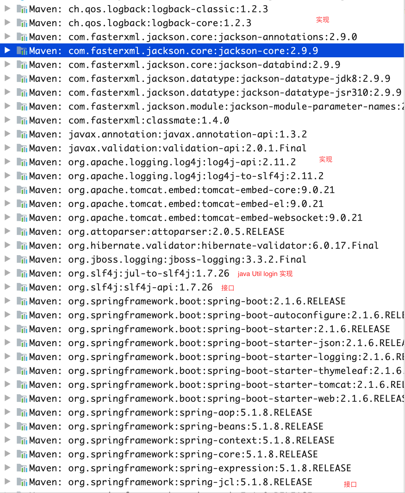

# springboot

官方文档： https://docs.spring.io/spring-boot/docs/

归档路径： https://docs.spring.io/spring-boot/docs/2.1.6.RELEASE/reference/htmlsingle/


## 遇到的坑

### 1.静态文件

更改静态文件后页面不刷新

If you use Thymeleaf, set `spring.thymeleaf.cache` to `false`. See [`ThymeleafAutoConfiguration`](https://github.com/spring-projects/spring-boot/tree/v2.1.6.RELEASE/spring-boot-project/spring-boot-autoconfigure/src/main/java/org/springframework/boot/autoconfigure/thymeleaf/ThymeleafAutoConfiguration.java) for other Thymeleaf customization options.


```yaml
#debug: true  #会覆盖下面的logging.level

server:
  port: 8080
  servlet:
    context-path: /jay

spring:
  freemarker:
    suffix: .html		#默认为.html
  thymeleaf:
    cache: false		#关闭springboot缓存
  mvc:
    date-format: yyyy-MM-dd HH:mm  #MVC层接收时间格式

  jackson:
    date-format: yyyy-MM-dd HH:mm  #MVC层返回时间格式
    time-zone: GMT+8	#指定时区，不然时间对应不上

logging:	#springboot自带日志
  level:
    root: INFO
    org.springframework.web: INFO

```


2.视图

```java
@RestController
public class UserController {

    //返回视图
    @GetMapping("/index")
    public ModelAndView index() {
        return new ModelAndView("index");
    }

  	//返回字符串，当@RestController 变成 @Controller时可以返回视图
    @GetMapping("/hi")
    public String hi() {
        return "index";
    }

    @GetMapping("/date")
    public Date date(Date date) {
        return date;
    }


    @GetMapping("/string")
    public String string(Date date) {
        return "datesss";
    }

}
```


### 2.idea 热更新

```
1: setting -> compiler -> buildProductauto

2: fn+command+F9
```


### 3.日志

| Name                  | Description                                                  | Pom                                                          |
| :-------------------- | :----------------------------------------------------------- | :----------------------------------------------------------- |
| `spring-boot-starter` | Core starter, including auto-configuration support, logging and YAML | [Pom](https://github.com/spring-projects/spring-boot/tree/v2.2.0.M4/spring-boot-project/spring-boot-starters/spring-boot-starter/pom.xml) |


```
Spring Boot uses Commons Logging for all internal logging, but leaves the underlying log implementation open. Default configurations are provided for Java Util Logging, Log4J2 and Logback. In each case loggers are pre-configured to use console output with optional file output also available.
Spring Boot所有的内部日志都采用Commons Logging，但开放了底层的日志实现。提供了对Java Util Logging，Log4J2和Logback的默认实现。在每个logger中都预先配置使用控制台作为输出，同时也可用可选的文件输出。


By default, If you use the ‘Starters’, Logback will be used for logging. Appropriate Logback routing is also included to ensure that dependent libraries that use Java Util Logging, Commons Logging, Log4J or SLF4J will all work correctly.
默认情况下，如果使用Starters，Logback将作为日志。也要包含恰当的Logback规则来保证依赖库使用Java Util Logging，Commons Logging，Log4J或SLF4J都能正确工作。


There are a lot of logging frameworks available for Java. Don’t worry if the above list seems confusing. Generally you won’t need to change your logging dependencies and the Spring Boot defaults will work just fine.
在Java中有许多日志框架可用。不必担心上面的列表看起来有点混乱。通常情况下你不需要改变你的日志依赖，Spring Boot默认情况下能很好的工作。

```





#### 3.1logback.xml

官网： https://logback.qos.ch/

```xml
<?xml version="1.0" encoding="UTF-8"?>
<configuration debug="false">

    <property name="PROJECT" value="mysb1" />

    <!--定义日志文件的存储地址 勿在 LogBack 的配置中使用相对路径-->

    <property name="ROOT" value="d:/logs/${PROJECT}/" />
    <!--日志文件最大的大小-->
    <property name="FILESIZE" value="50MB" />
    <!--日志文件保留天数-->
    <property name="MAXHISTORY" value="100" />
    <timestamp key="DATETIME" datePattern="yyyy-MM-dd HH:mm:ss" />
    <!-- 控制台打印 -->
    <appender name="STDOUT" class="ch.qos.logback.core.ConsoleAppender">
        <encoder charset="utf-8">
            <pattern>[%-5level] %d{${DATETIME}} [%thread] %logger{36} - %m%n
            </pattern>
        </encoder>
    </appender>
    <!-- ERROR 输入到文件，按日期和文件大小 -->
    <!-- RollingFileAppender 按照每天生成日志文件 -->
    <appender name="ERROR" class="ch.qos.logback.core.rolling.RollingFileAppender">
        <encoder charset="utf-8">
            <!--格式化输出：%d表示日期，%thread表示线程名，%-5level：级别从左显示5个字符宽度%msg：日志消息，%n是换行符-->
            <pattern>[%-5level] %d{${DATETIME}} [%thread] %logger{36} - %m%n
            </pattern>
        </encoder>
        <filter class="ch.qos.logback.classic.filter.LevelFilter">
            <level>ERROR</level>
            <onMatch>ACCEPT</onMatch>
            <onMismatch>DENY</onMismatch>
        </filter>
        <rollingPolicy class="ch.qos.logback.core.rolling.TimeBasedRollingPolicy">
            <!--日志文件输出的文件名-->
            <fileNamePattern>${ROOT}%d/error.%i.log</fileNamePattern>
            <!--日志文件保留天数-->
            <maxHistory>${MAXHISTORY}</maxHistory>
            <timeBasedFileNamingAndTriggeringPolicy
                    class="ch.qos.logback.core.rolling.SizeAndTimeBasedFNATP">
                <!--日志文件最大的大小-->
                <maxFileSize>${FILESIZE}</maxFileSize>
            </timeBasedFileNamingAndTriggeringPolicy>
        </rollingPolicy>
    </appender>

    <!-- WARN 输入到文件，按日期和文件大小 -->
    <appender name="WARN" class="ch.qos.logback.core.rolling.RollingFileAppender">
        <encoder charset="utf-8">
            <pattern>[%-5level] %d{${DATETIME}} [%thread] %logger{36} - %m%n
            </pattern>
        </encoder>
        <filter class="ch.qos.logback.classic.filter.LevelFilter">
            <level>WARN</level>
            <onMatch>ACCEPT</onMatch>
            <onMismatch>DENY</onMismatch>
        </filter>
        <rollingPolicy class="ch.qos.logback.core.rolling.TimeBasedRollingPolicy">
            <fileNamePattern>${ROOT}%d/warn.%i.log</fileNamePattern>
            <maxHistory>${MAXHISTORY}</maxHistory>
            <timeBasedFileNamingAndTriggeringPolicy class="ch.qos.logback.core.rolling.SizeAndTimeBasedFNATP">
                <maxFileSize>${FILESIZE}</maxFileSize>
            </timeBasedFileNamingAndTriggeringPolicy>
        </rollingPolicy>
    </appender>

    <!-- INFO 输入到文件，按日期和文件大小 -->
    <appender name="INFO" class="ch.qos.logback.core.rolling.RollingFileAppender">
        <encoder charset="utf-8">
            <pattern>[%-5level] %d{${DATETIME}} [%thread] %logger{36} - %m%n
            </pattern>
        </encoder>
        <filter class="ch.qos.logback.classic.filter.LevelFilter">
            <level>INFO</level>
            <onMatch>ACCEPT</onMatch>
            <onMismatch>DENY</onMismatch>
        </filter>
        <rollingPolicy class="ch.qos.logback.core.rolling.TimeBasedRollingPolicy">
            <fileNamePattern>${ROOT}%d/info.%i.log</fileNamePattern>
            <maxHistory>${MAXHISTORY}</maxHistory>
            <timeBasedFileNamingAndTriggeringPolicy class="ch.qos.logback.core.rolling.SizeAndTimeBasedFNATP">
                <maxFileSize>${FILESIZE}</maxFileSize>
            </timeBasedFileNamingAndTriggeringPolicy>
        </rollingPolicy>
    </appender>
    <!-- DEBUG 输入到文件，按日期和文件大小 -->
    <appender name="DEBUG" class="ch.qos.logback.core.rolling.RollingFileAppender">
        <encoder charset="utf-8">
            <pattern>[%-5level] %d{${DATETIME}} [%thread] %logger{36} - %m%n
            </pattern>
        </encoder>
        <filter class="ch.qos.logback.classic.filter.LevelFilter">
            <level>DEBUG</level>
            <onMatch>ACCEPT</onMatch>
            <onMismatch>DENY</onMismatch>
        </filter>
        <rollingPolicy class="ch.qos.logback.core.rolling.TimeBasedRollingPolicy">
            <fileNamePattern>${ROOT}%d/debug.%i.log</fileNamePattern>
            <maxHistory>${MAXHISTORY}</maxHistory>
            <timeBasedFileNamingAndTriggeringPolicy
                    class="ch.qos.logback.core.rolling.SizeAndTimeBasedFNATP">
                <maxFileSize>${FILESIZE}</maxFileSize>
            </timeBasedFileNamingAndTriggeringPolicy>
        </rollingPolicy>
    </appender>
    <!-- TRACE 输入到文件，按日期和文件大小 -->
    <appender name="TRACE" class="ch.qos.logback.core.rolling.RollingFileAppender">
        <encoder charset="utf-8">
            <pattern>[%-5level] %d{${DATETIME}} [%thread] %logger{36} - %m%n
            </pattern>
        </encoder>
        <filter class="ch.qos.logback.classic.filter.LevelFilter">
            <level>TRACE</level>
            <onMatch>ACCEPT</onMatch>
            <onMismatch>DENY</onMismatch>
        </filter>
        <rollingPolicy
                class="ch.qos.logback.core.rolling.TimeBasedRollingPolicy">
            <fileNamePattern>${ROOT}%d/trace.%i.log</fileNamePattern>
            <maxHistory>${MAXHISTORY}</maxHistory>
            <timeBasedFileNamingAndTriggeringPolicy
                    class="ch.qos.logback.core.rolling.SizeAndTimeBasedFNATP">
                <maxFileSize>${FILESIZE}</maxFileSize>
            </timeBasedFileNamingAndTriggeringPolicy>
        </rollingPolicy>
    </appender>

    <!-- SQL相关日志输出-->
    <logger name="org.apache.ibatis" level="INFO" additivity="false" />
    <logger name="org.mybatis.spring" level="INFO" additivity="false" />
    <logger name="com.github.miemiedev.mybatis.paginator" level="INFO" additivity="false" />

    <!-- Logger 根目录 -->
    <!-- 日志输出级别 -->
    <root level="DEBUG">
        <appender-ref ref="STDOUT" />
        <appender-ref ref="DEBUG" />
        <appender-ref ref="ERROR" />
        <appender-ref ref="WARN" />
        <appender-ref ref="INFO" />
        <appender-ref ref="TRACE" />
    </root>
</configuration>
```


源码解析：

SpringServletContainerInitializer