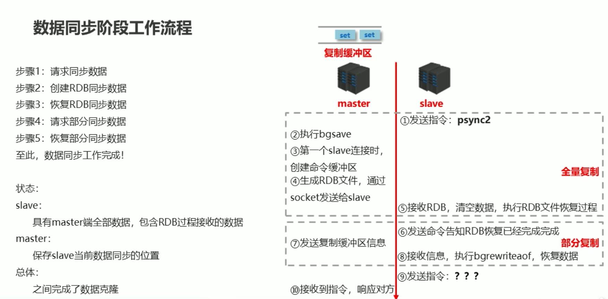
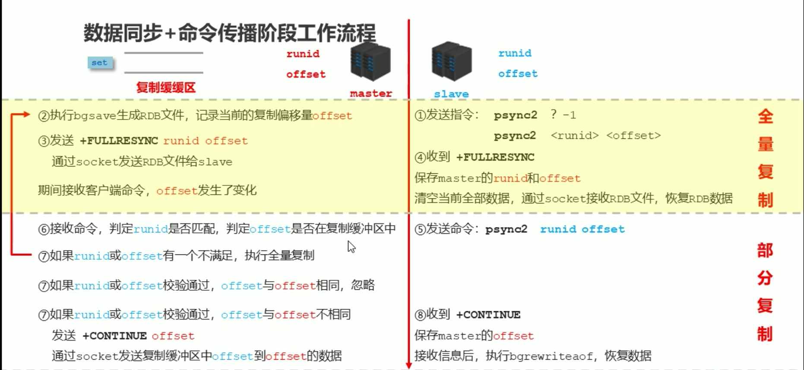
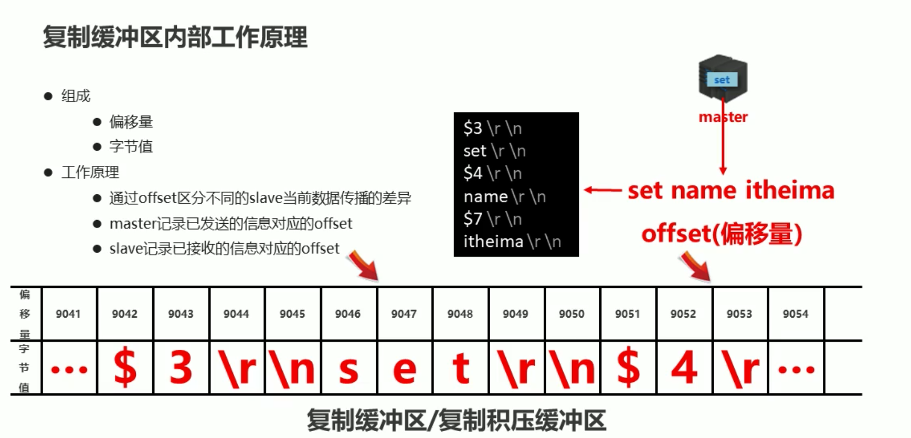

#redis 主从配置
3高
```text
1.高并非
2.高性能
3.高可用
```


主从复制架构


主从复制的作用：
```text
读写分离
负载均衡
故障转移
```

##主从复制的3步流程


###1.建立连接阶段
    
    
    主从配置
    方式1,客户端发送命令: slaveof masterIp masterPort
    方式2,启动服务器参数: redis-server --slaveof masterIp masterPort
    方式3,配置文件: slaveof masterIp masterPort
    
    断开主从
    slaveof no one
    

###2.数据同步阶段




```text
master : 这里可以优化缓冲区大小： repl-backlog-size 10mb

slave配置为只读：slave-serve-stable-data yes|no

```


```text
maste日志：
12692:M 29 Mar 00:20:56.521 * Slave 172.16.229.197:6379 asks for synchronization
12692:M 29 Mar 00:20:56.521 * Full resync requested by slave 172.16.229.197:6379
12692:M 29 Mar 00:20:56.521 * Starting BGSAVE for SYNC with target: disk
12692:M 29 Mar 00:20:56.522 * Background saving started by pid 12710
12710:C 29 Mar 00:20:56.532 * DB saved on disk
12710:C 29 Mar 00:20:56.533 * RDB: 6 MB of memory used by copy-on-write
12692:M 29 Mar 00:20:56.540 * Background saving terminated with success
12692:M 29 Mar 00:20:56.541 * Synchronization with slave 172.16.229.197:6379 succeeded

slave日志：
8540:S 29 Mar 00:20:56.589 * MASTER <-> SLAVE sync: Finished with success
8540:S 29 Mar 00:20:56.590 * Background append only file rewriting started by pid 8544
8540:S 29 Mar 00:20:56.662 * AOF rewrite child asks to stop sending diffs.
8544:C 29 Mar 00:20:56.662 * Parent agreed to stop sending diffs. Finalizing AOF...
8544:C 29 Mar 00:20:56.662 * Concatenating 0.00 MB of AOF diff received from parent.
8544:C 29 Mar 00:20:56.662 * SYNC append only file rewrite performed
8544:C 29 Mar 00:20:56.663 * AOF rewrite: 6 MB of memory used by copy-on-write
8540:S 29 Mar 00:20:56.668 * Background AOF rewrite terminated with success
8540:S 29 Mar 00:20:56.668 * Residual parent diff successfully flushed to the rewritten AOF (0.00 MB)
8540:S 29 Mar 00:20:56.668 * Background AOF rewrite finished successfully

```   


##master conf
```text
[root@xupan001 redis-4.0.9]# cat conf/redis-6379.conf 
port 6379
daemonize yes
logfile /usr/local/dev/redis/redis-4.0.9/log/redis-6379.log
dir /usr/local/dev/redis/redis-4.0.9/data

dbfilename dump-6379.rdb
rdbcompression yes
rdbchecksum yes

save 10 2

appendonly yes
appendfsync always

databases 16

protected-mode no
```

##slave conf
```text
[root@xupan002 redis-4.0.9]# cat conf/redis-6379.conf 
port 6379
daemonize yes
logfile /usr/local/dev/redis/redis-4.0.9/log/redis-6379.log
dir /usr/local/dev/redis/redis-4.0.9/data

dbfilename dump-6379.rdb
rdbcompression yes
rdbchecksum yes

save 10 2

appendonly yes
appendfsync always

databases 16

slaveof 172.16.229.196 6379
```

##服务器运行ID（runId）
runid是每个redis-server的身份识别码，一台服务器多次运行可以生成多个身份识别码
runid是40位字符组成
runid作用于服务器之间传输，身份识别
每个redis-server启动的时候自动生成，master首次连接上slave的时候会将自己的runid发送给slave，slave保存此ID
通过info server可以查看runid


##复制换从区



##3.数据同步
