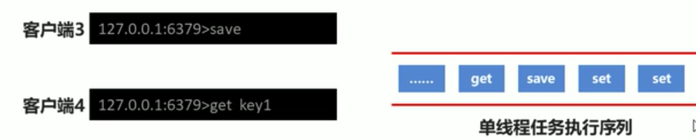

#RDB
    RDB:快照形式，存储数据结果，存储格式简单，关注点在数据，没有办法做到实时持久化，非常适合全量备份
    AOF:日志形式，存储操作过程，存储格式复杂，关注点在数据的操作过
    
##1.rdb >> save指令，会生成rdb文件
```text

127.0.0.1:6379> set username jay
OK
127.0.0.1:6379> save
OK

[root@xupan001 redis-4.0.9]# ll data/
total 4
-rw-r--r--. 1 root root 121 Mar 28 02:34 dump.rdb
[root@xupan001 redis-4.0.9]# 

```


##2.RDB，save指令配置文件相关
```text
dbfilename: dump文件的名称
rdbcompression：dump文件是否开启压缩
rdbchecksum ： dump是否开启检测

[root@xupan001 redis-4.0.9]# cat conf/redis-6379.conf 

port 6379
daemonize yes
logfile /usr/local/dev/redis/redis-4.0.9/log/redis-6379.log
dir /usr/local/dev/redis/redis-4.0.9/data

dbfilename dump-6379.rdb
rdbcompression yes
rdbchecksum yes   
```

##3.启动6379redis-server > set > save -> 查看data/dump
```text
[root@xupan001 redis-4.0.9]# redis-server conf/redis-6379.conf 
[root@xupan001 redis-4.0.9]# ps -ef | grep redis
root      10285      1  0 02:57 ?        00:00:00 redis-server *:6379
root      10292   7914  0 02:57 pts/1    00:00:00 grep --color=auto redis
[root@xupan001 redis-4.0.9]# redis-cli -p 6379
127.0.0.1:6379> get username
(nil)
127.0.0.1:6379> set username
(error) ERR wrong number of arguments for 'set' command
127.0.0.1:6379> set username jay
OK
127.0.0.1:6379> save

[root@xupan001 data]# ls
dump-6379.rdb

```


##4.save的工作原理
    阻塞 Redis 主进程，直到保存完成为止。在主进程阻塞期间，服务器不能处理客户端的任何请求, 性能低。
    

    bgsave fork 出一个子进程，子进程负责调用 rdbSave ，并在保存完成之后向主进程发送信号，通知保存已完成。
    因为 rdbSave 在子进程被调用，所以 Redis 服务器在BGSAVE 执行期间仍然可以继续处理客户端的请求。
    
save:



bgsave:

    

    