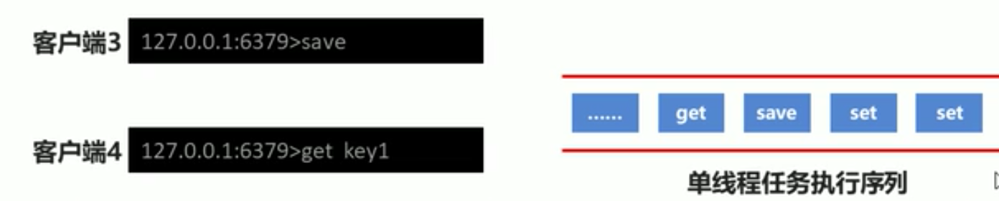
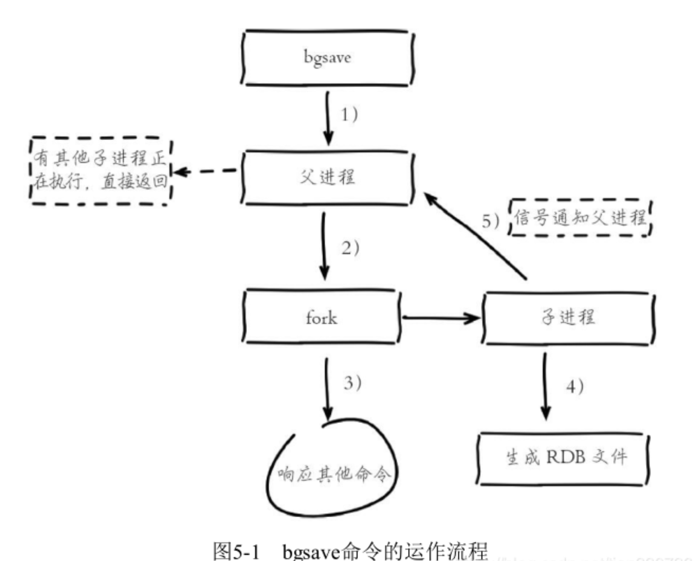

#RDB
    RDB:快照形式，redis可以在某个时间点上对内存中的数据创建一个副本文件， 
        关注点在数据，没有办法做到实时持久化，副本文件中的数据在redis重启时会被自动加载，
        我们也可以将副本文件拷贝到其他地方一样可以使用
        缺点：fork一个子进程又要耗费资源，在一些极端情况下，fork子进程的时间甚至超过数据备份的时间
    
    
    AOF:日志形式，存储操作过程，存储格式复杂，关注点在数据的操作过
    
    
##0.shutdown 会触发bgsave， kill 不会触发bgsave


##1.rdb >> save指令，会生成rdb文件
```text

127.0.0.1:6379> set username jay
OK
127.0.0.1:6379> save
OK

[root@xupan001 redis-4.0.9]# ll data/
total 4
-rw-r--r--. 1 root root 121 Mar 28 02:34 dump.rdb
[root@xupan001 redis-4.0.9]# 

```


##2.RDB，save指令配置文件相关
```text
dbfilename: dump文件的名称
rdbcompression：dump文件是否开启压缩
rdbchecksum ： dump是否开启检测

[root@xupan001 redis-4.0.9]# cat conf/redis-6379.conf 

port 6379
daemonize yes
logfile /usr/local/dev/redis/redis-4.0.9/log/redis-6379.log
dir /usr/local/dev/redis/redis-4.0.9/data

dbfilename dump-6379.rdb
rdbcompression yes
rdbchecksum yes   
```

##3.启动6379redis-server > set > save -> 查看data/dump
```text
[root@xupan001 redis-4.0.9]# redis-server conf/redis-6379.conf 
[root@xupan001 redis-4.0.9]# ps -ef | grep redis
root      10285      1  0 02:57 ?        00:00:00 redis-server *:6379
root      10292   7914  0 02:57 pts/1    00:00:00 grep --color=auto redis
[root@xupan001 redis-4.0.9]# redis-cli -p 6379
127.0.0.1:6379> get username
(nil)
127.0.0.1:6379> set username
(error) ERR wrong number of arguments for 'set' command
127.0.0.1:6379> set username jay
OK
127.0.0.1:6379> save

[root@xupan001 data]# ls
dump-6379.rdb

```


##4.save,bgsave的工作原理
    save : 阻塞 Redis 主进程，直到保存完成为止。在主进程阻塞期间，服务器不能处理客户端的任何请求, 性能低。
    

    bgsave fork 出一个子进程，子进程负责调用rdbSave生成一个零时dump文件，替换之前的dump文件，之后向主进程发送信号，通知保存已完成。
    因为 rdbSave 在子进程被调用，所以 Redis 服务器在BGSAVE 执行期间仍然可以继续处理客户端的请求。
   
    准备一个1G的rdb文件，改变conf配置让其加载该数据文件，在redis-cli中调用bgsave, 新打开窗口执行ps -ef | grep redis观察到多了一个进程，
    打开data目录，发现多了一个temp文件，完成后temp文件消失  
save:



bgsave:

    

##bgsave 命令 >> 会触发bgsave
```text
127.0.0.1:6379> set password mmmmmmmmmmmmmmmm
OK
127.0.0.1:6379> BGSAVE
Background saving started


[root@xupan001 data]# ll ../data/
total 4
-rw-r--r--. 1 root root 111 Mar 28 02:58 dump-6379.rdb
[root@xupan001 data]# ll ../data/
total 4
-rw-r--r--. 1 root root 138 Mar 28 03:40 dump-6379.rdb

```
##查看bgsave 的日志文件
    10396:M 28 Mar 03:40:44.718 * Background saving terminated with success
    


##配置文件save自动执行持久化 >> 会触发bgsave
1) 配置 
    1. save second changes
2) 作用 
    2. 在指定时间范围内只要key变化数达到指定数量就进行持久化，如果没有达到不做持久化操作
3) 参数
    3. second : 监控实践范围
    4. changes : 监控key的变化数量
4) 范例
   4. 
   ```text
      save    900     1    #15 分钟变化1个就保存
      save    300     10   #5分钟内变化10个就保存
      save    60      1000 #1分钟变化1000就保存

   配置文件默认会使用bgsave,update的次数和时间满足一定条件会触发bgsave
   ```
    

```text
[root@xupan001 conf]# vim  redis-6379.conf 
port 6379
daemonize yes
logfile /usr/local/dev/redis/redis-4.0.9/log/redis-6379.log
dir /usr/local/dev/redis/redis-4.0.9/data

dbfilename dump-6379.rdb
rdbcompression yes
rdbchecksum yes
 
save 10 2
```


##redis bgsave默认配置，快照持久化默认就是开启的
[root@xupan001 redis-4.0.9]# cat redis.conf | grep -v "#" | grep -v "^$" | grep "save"
save 900 1
save 300 10
save 60 10000


##关闭RDB
删除
save 900 1
save 300 10
save 60 10000

或
save ""

``注意:``如果是用来主从复制，RDB是关不掉的