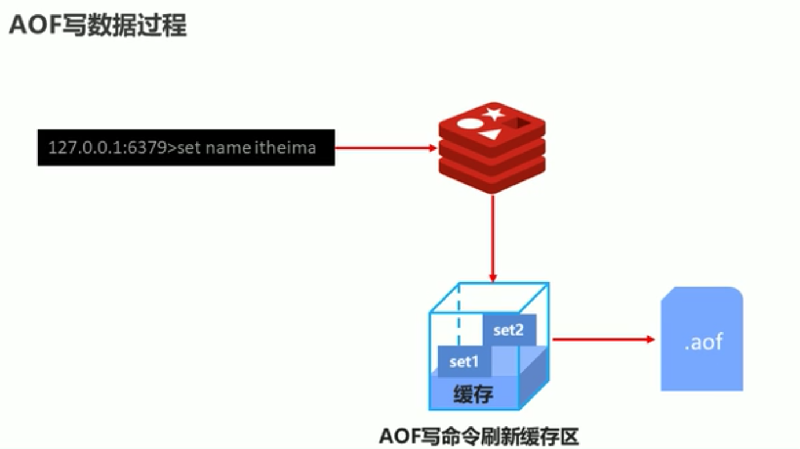

#AOF
    RDB: 存在数据丢失，数据量大的时候性能消耗，不同版本dump文件不兼容
    
AOF：
    主要解决的是操作的实时性，AOF持久化是将被执行的命令写到aof文件末尾，在恢复时只需要从头到尾执行一遍写命令即可恢复数据
    AOF在redis中默认也是没有开启的，需要我们手动开启
    




##AOF写数据的策略有3个：首选everysec，always选项会严重降低redis性能
```text
1.always 每次update
2.everysec 每秒update
3.no 系统控制
```


##开启AOF,默认no
    appendonly yes|no

##配置AOF策略
    appendfsync always|everysec|no
    
    
##配置
```text
[root@xupan001 redis-4.0.9]# vim conf/redis-6379.conf 
port 6379
daemonize yes
logfile /usr/local/dev/redis/redis-4.0.9/log/redis-6379.log
dir /usr/local/dev/redis/redis-4.0.9/data

dbfilename dump-6379.rdb
rdbcompression yes
rdbchecksum yes

save 10 2

appendonly yes
appendfsync always
```

##查看dump文件变化
```text

先执行执行get，再执行set
    [root@xupan001 redis-4.0.9]# redis-cli 
    127.0.0.1:6379> get *
    (nil)
    127.0.0.1:6379> set name 123
    OK
    127.0.0.1:6379> set name 456
    OK
    127.0.0.1:6379> set name 789
    OK
    127.0.0.1:6379> 


再查看aof文件
    [root@xupan001 redis-4.0.9]# cat data/appendonly.aof 
    *2
    $6
    SELECT
    $1
    0
    *3
    $3
    set
    $4
    name
    $3
    123
    *3
    $3
    set
    $4
    name
    $3
    456
    *3
    $3
    set
    $4
    name
    $3
    789
```
---
结论：查看aof文件发现记录了get, 和对相同key的多个set，实际上相key只有最后一个set有用，get不需要记录
---


##AOF重写规则
```text
对于相同的key,只有最后一个有效，get不做任何记录，失效的key不做记录

手动
bgrewriteaof

自动
auto-aof-rewriteaof-min-size size
auto-aof-rewriteaof-percentage percentage

```


```text
手动

127.0.0.1:6379> bgrewriteaof
Background append only file rewriting started

[root@xupan001 redis-4.0.9]# cat data/appendonly.aof 
*2
$6
SELECT
$1
0
*3
$3
SET
$4
name
$3
789

```

 ```text
自动触发条件设置：
auto-aof-rewriteaof-min-size size
auto-aof-rewriteaof-percentage percentage

自动触发对比参数：
aof_current_size
aof_base_size

触发条件
aof_current_size > auto-aof-rewriteaof-min-size 


(aof_current_size - aof_base_size) / aof_base_size  >= auto-aof-rewriteaof-percentage


```


##redis AOF默认配置, aof默认没有开启
```text
[root@xupan001 redis-4.0.9]# cat redis.conf | grep -v "#" | grep -v "^$" | grep "aof"
appendfilename "appendonly.aof"
auto-aof-rewrite-percentage 100
auto-aof-rewrite-min-size 64mb
aof-load-truncated yes
aof-use-rdb-preamble no
aof-rewrite-incremental-fsync yes

[root@xupan001 redis-4.0.9]# cat redis.conf | grep -v "#" | grep -v "^$" | grep "append"
appendonly no
appendfilename "appendonly.aof"
appendfsync everysec
no-appendfsync-on-rewrite no

```


##查看redis运行参数
```text
127.0.0.1:6379> info
# Server
redis_version:4.0.9
redis_git_sha1:00000000
redis_git_dirty:0
redis_build_id:6eb65d237133b38
redis_mode:standalone
os:Linux 3.10.0-229.el7.x86_64 x86_64
arch_bits:64
multiplexing_api:epoll
atomicvar_api:atomic-builtin
gcc_version:4.8.3
process_id:13553
run_id:1bc97583a736df48bf8af8e155f356fffd6b5ed4
tcp_port:6379
uptime_in_seconds:1522
uptime_in_days:0
hz:10
lru_clock:8343931
executable:/usr/local/dev/redis/redis-4.0.9/redis-server
config_file:/usr/local/dev/redis/redis-4.0.9/conf/redis-6379.conf

# Clients
connected_clients:1
client_longest_output_list:0
client_biggest_input_buf:0
blocked_clients:0

# Memory
used_memory:848864
used_memory_human:828.97K
used_memory_rss:7880704
used_memory_rss_human:7.52M
used_memory_peak:849136
used_memory_peak_human:829.23K
used_memory_peak_perc:99.97%
used_memory_overhead:836390
used_memory_startup:786648
used_memory_dataset:12474
used_memory_dataset_perc:20.05%
total_system_memory:1915404288
total_system_memory_human:1.78G
used_memory_lua:37888
used_memory_lua_human:37.00K
maxmemory:0
maxmemory_human:0B
maxmemory_policy:noeviction
mem_fragmentation_ratio:9.28
mem_allocator:jemalloc-4.0.3
active_defrag_running:0
lazyfree_pending_objects:0

# Persistence
loading:0
rdb_changes_since_last_save:0
rdb_bgsave_in_progress:0
rdb_last_save_time:1585401583
rdb_last_bgsave_status:ok
rdb_last_bgsave_time_sec:0
rdb_current_bgsave_time_sec:-1
rdb_last_cow_size:6381568
aof_enabled:1
aof_rewrite_in_progress:0
aof_rewrite_scheduled:0
aof_last_rewrite_time_sec:0
aof_current_rewrite_time_sec:-1
aof_last_bgrewrite_status:ok
aof_last_write_status:ok
aof_last_cow_size:6385664
aof_current_size:87
aof_base_size:87
aof_pending_rewrite:0
aof_buffer_length:0
aof_rewrite_buffer_length:0
aof_pending_bio_fsync:0
aof_delayed_fsync:0

# Stats
total_connections_received:1
total_commands_processed:25
instantaneous_ops_per_sec:0
total_net_input_bytes:1035
total_net_output_bytes:10638
instantaneous_input_kbps:0.00
instantaneous_output_kbps:0.00
rejected_connections:0
sync_full:0
sync_partial_ok:0
sync_partial_err:0
expired_keys:0
expired_stale_perc:0.00
expired_time_cap_reached_count:0
evicted_keys:0
keyspace_hits:1
keyspace_misses:2
pubsub_channels:0
pubsub_patterns:0
latest_fork_usec:723
migrate_cached_sockets:0
slave_expires_tracked_keys:0
active_defrag_hits:0
active_defrag_misses:0
active_defrag_key_hits:0
active_defrag_key_misses:0

# Replication
role:master
connected_slaves:0
master_replid:46f0776f0b298a78089b42054c0bc05563ddf5f2
master_replid2:0000000000000000000000000000000000000000
master_repl_offset:0
second_repl_offset:-1
repl_backlog_active:0
repl_backlog_size:1048576
repl_backlog_first_byte_offset:0
repl_backlog_histlen:0

# CPU
used_cpu_sys:1.64
used_cpu_user:0.60
used_cpu_sys_children:0.04
used_cpu_user_children:0.00

# Cluster
cluster_enabled:0

# Keyspace
db0:keys=2,expires=0,avg_ttl=0
```
