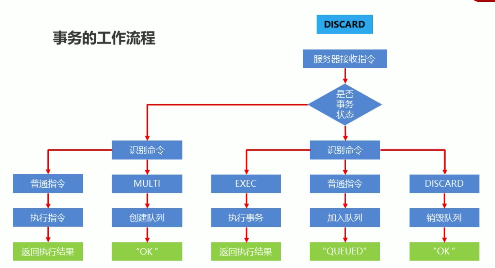

#redis 事务

##1.开启事务 multi
    设置开启事务位置，后续操作均加入事务中
    
##2. 关闭事务 exec
    设置关闭事务位置，同时执行事务，与multi成对使用
    
##3. 取消事务 discard
    终止事务，发生在multi后，exec前
    
    
client-1
```text

127.0.0.1:6379> get  name
"jay"
127.0.0.1:6379> MULTI           时间点1开启事务，更新
OK
127.0.0.1:6379> set name haha
QUEUED
127.0.0.1:6379> 


127.0.0.1:6379> EXEC            时间点2提交事务
1) OK


```

client-2
```text

127.0.0.1:6379> get name
"jay"
127.0.0.1:6379> get name        时间点1-1获取为旧值
"jay"
127.0.0.1:6379> 

127.0.0.1:6379> get name        时间点2-2 获取到最新值
"haha"

```


