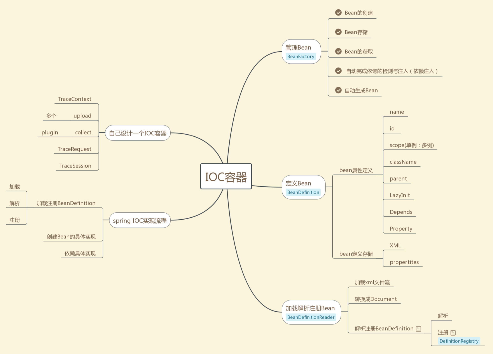

# springIOC 深度解析

IOC容器




BeanFactory接口定义，这里面不涉及存储

```java
import org.springframework.beans.BeansException;
import org.springframework.core.ResolvableType;

public interface BeanFactory {

   String FACTORY_BEAN_PREFIX = "&";
   
   Object getBean(String name) throws BeansException;
   
   <T> T getBean(String name, Class<T> requiredType) throws BeansException;
   
   Object getBean(String name, Object... args) throws BeansException;

   <T> T getBean(Class<T> requiredType) throws BeansException;
  
   <T> T getBean(Class<T> requiredType, Object... args) throws BeansException;

   boolean containsBean(String name);

   boolean isSingleton(String name) throws NoSuchBeanDefinitionException;

   boolean isPrototype(String name) throws NoSuchBeanDefinitionException;
   
   boolean isTypeMatch(String name, ResolvableType typeToMatch) throws NoSuchBeanDefinitionException;

   boolean isTypeMatch(String name, Class<?> typeToMatch) throws NoSuchBeanDefinitionException;
  
   Class<?> getType(String name) throws NoSuchBeanDefinitionException;
   
   String[] getAliases(String name);

}
```

Beanfacuory常用实现类DefaultListableBeanFactory和AbstractBeanFactory

DefaultListableBeanFactoryTests.java

```java
@Test
	public void testCreateBean() {
		DefaultListableBeanFactory lbf = new DefaultListableBeanFactory();
		TestBean tb = lbf.createBean(TestBean.class);
		assertSame(lbf, tb.getBeanFactory());
		lbf.destroyBean(tb);
	}
```


注册Bean

```java
@Test
public void testRegisterExistingSingletonWithAlreadyBound() {
   DefaultListableBeanFactory lbf = new DefaultListableBeanFactory();
   Object singletonObject = new TestBean();
   lbf.registerSingleton("singletonObject", singletonObject);
   try {
      lbf.registerSingleton("singletonObject", singletonObject);
      fail("Should have thrown IllegalStateException");
   }
   catch (IllegalStateException ex) {
      // expected
   }
}
```