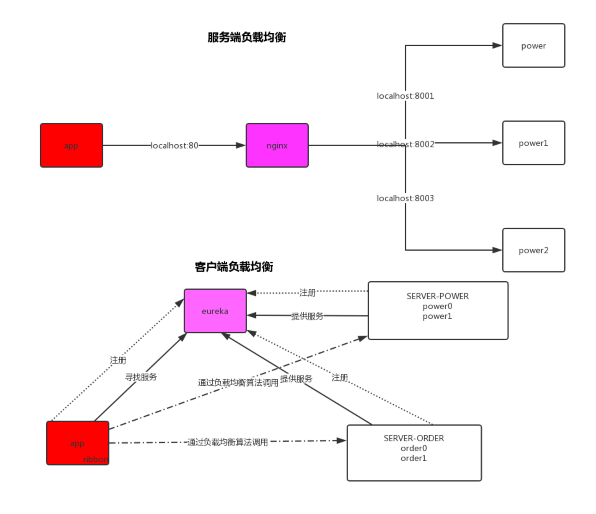
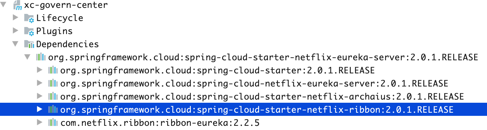
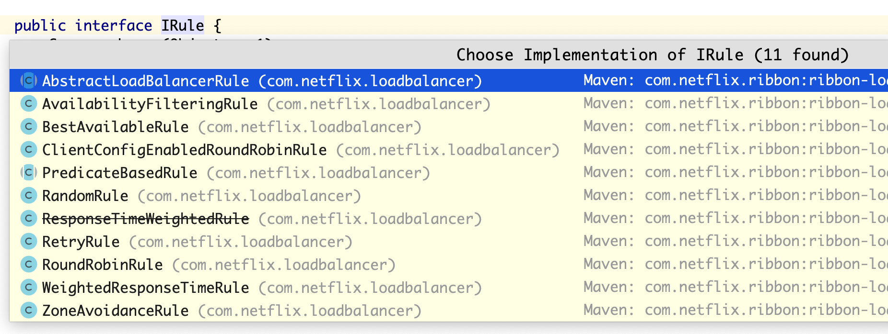

# Ribbon客户端负载均衡

## ribbon是什么

Ribbon是Netflix发布的开源项目，主要功能是提供客户端的软件负载均衡算法，将Netflix的中间层服
务连接在一起。Ribbon客户端组件提供一系列完善的配置项如连接超时，重试等。简单的说，就是在配置文件中
列出Load Balancer(简称LB)后面所有的机器，Ribbon会自动的帮助你基于某种规则(如简单轮询，随机连接
等)去连接这些机器。我们也很容易使用Ribbon实现自定义的负载均衡算法。


假设nginx后面有一个服务down机了，nginx并没发知道该服务已经down机，请求来了会打到这台机器上去，客户浏览器会一直转圈圈





eureka-server会对ribbon的jar包进行以来




## 怎么使用

客户端配置：

```java
@Bean
@LoadBalanced
public RestTemplate restTemplate(){
    RestTemplate restTemplate = new RestTemplate();
    return restTemplate;
}
```


客户端调用服务：

```java
@Autowired
RestTemplate restTemplate;

private static final String  ORDER_URL="http://SERVER-ORDER";

@RequestMapping("/getOrder.do")
public R getOrder(){
    return R.success("操作成功",restTemplate.getForObject(ORDER_URL+"/getOrder.do",Object.class));
}
```


## IRule组件

IRule是负载均衡策略接口,默认是轮训

ribbon负载均衡默认的实现如下：



RandomRule:随机

RoundRobinRule:轮循

WeightedResponseTimeRule:更加平均响应时间计算权重，响应时间快的服务权重大，服务刚启动的时候采集的信息不会使用Round，信息足够的时候会使用权重

RetryRule:先按照轮循策略服务，如果获取服务失败会在指定时间内重试，如果还获取不到则放弃（测试的时候需要调长Eureka的服务剔除时间）

//todo


更改策略：

```java
@Bean 
public IRule iRule(){
    return  new RoundRobinRule();
}
```


## 自定义策略


# feign负载均衡

feign是什么 :

```
Feign是一个声明式WebService客户端。使用Feign能让编写Web Service客户端更加简单, 它的使用方法是定义一
个接口，然后在上面添加注解，同时也支持JAX-RS标准的注解。Feign也支持可拔插式的编码器和解码器。Spring
Cloud对Feign进行了封装，使其支持了Spring MVC标准注解和HttpMessageConverters。Feign可以与Eureka和
Ribbon组合使用以支持负载均衡。
```


feign 能干什么:

```
Feign旨在使编写Java Http客户端变得更容易。 前面在使用Ribbon+RestTemplate时，利用RestTemplate对http
请求的封装处理，形成了一套模版化的调用方法。但是在实际开发中，由于对服务依赖的调用可能不止一处，往往
一个接口会被多处调用，所以通常都会针对每个微服务自行封装一些客户端类来包装这些依赖服务的调用。所以，
Feign在此基础上做了进一步封装，由他来帮助我们定义和实现依赖服务接口的定义。在Feign的实现下，我们只需
创建一个接口并使用注解的方式来配置它(以前是Dao接口上面标注Mapper注解,现在是一个微服务接口上面标注一
个Feign注解即可)，即可完成对服务提供方的接口绑定，简化了使用Spring cloud Ribbon时，自动封装服务调用客
户端的开发量。
```


## 在客户端引入依赖

```xml
<dependency>
    <groupId>org.springframework.cloud</groupId>
    <artifactId>spring-cloud-starter-openfeign</artifactId>
</dependency>
```


## 客户端启动类添加@EnableFeignClients

```java
@EnableFeignClients
public class UcenterApplication {
    public static void main(String[] args) throws Exception {
        SpringApplication.run(UcenterApplication.class, args);
    }
}
```


## 客户端指定要到用的接口

```java
@FeignClient(value = XcServiceList.XC_SERVICE_UCENTER)
public interface UserClient {
    //根据账号查询用户信息
    @GetMapping("/ucenter/getuserext")
    public XcUserExt getUserext(@RequestParam("username") String username);
}
```


## 客户端调用

```java
@Service
public class UserDetailsServiceImpl{

	@Autowired
	UserClient userClient;

  //远程调用用户中心根据账号查询用户信息
  XcUserExt userext = userClient.getUserext(username);
  
}
```


## 服务端代码是普通Controller

```java
@RestController
@RequestMapping("/ucenter")
public class UcenterController implements UcenterControllerApi {
    @Autowired
    UserService userService;

    @Override
    @GetMapping("/getuserext")
    public XcUserExt getUserext(@RequestParam("username") String username) {
        return userService.getUserExt(username);
    }
}
```


