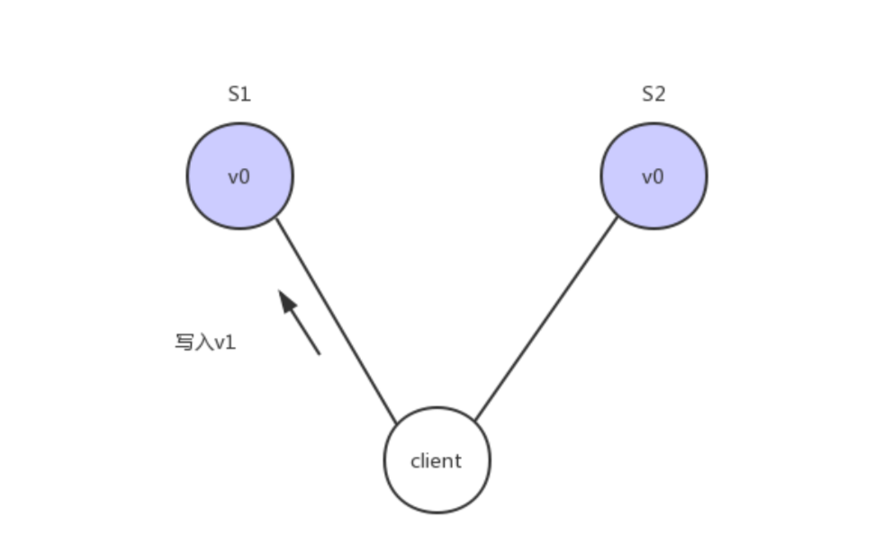
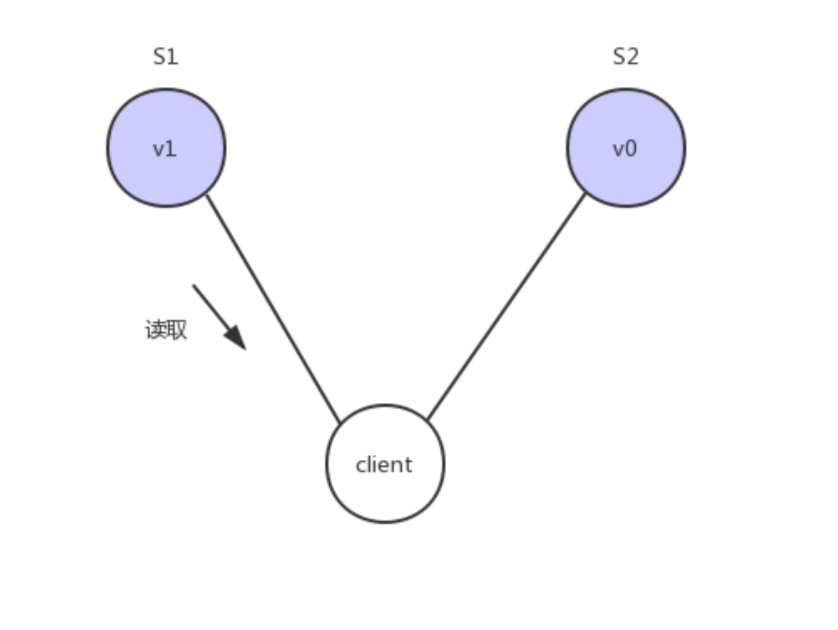
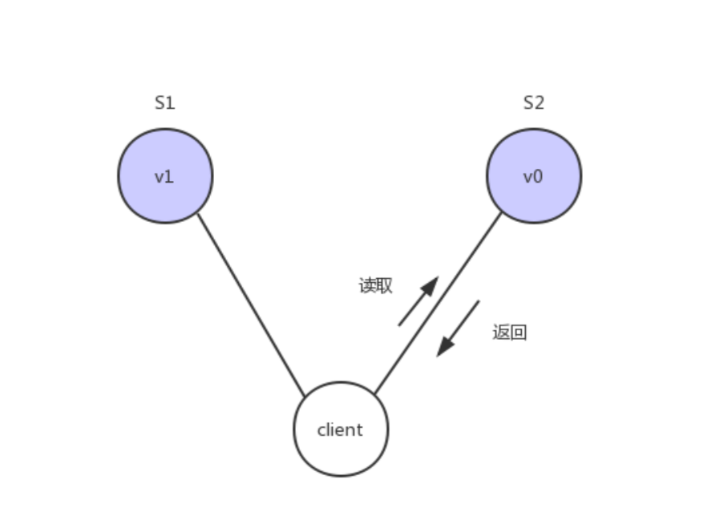
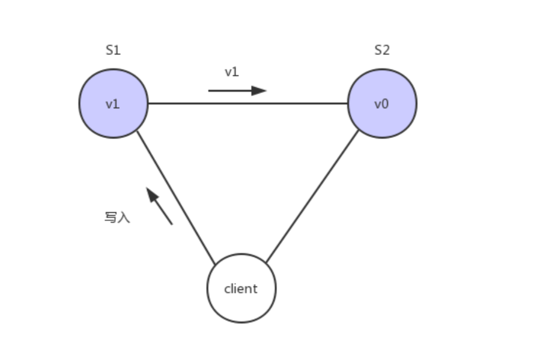
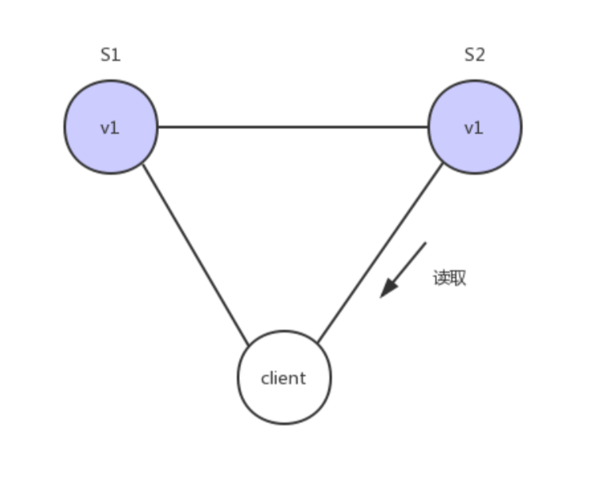

# eureka

## eureka是什么

eureka是Netflix的子模块之一，也是一个核心的模块，eureka里有2个组件

```
一个是EurekaServer(一个独立的项 目) 这个是用于定位服务以实现中间层服务器的负载平衡和故障转移，注册发现
另一个便是EurekaClient(我们的微服务) 它是用于与Server交互的，可以使得交互变得非常简单:只需要通过服务标识符即可拿到服务，同时Eureka会用自己的服务剔除机制保证服务可用。
```


## eureka自我保护机制

Eureka在设计的时候遵循的是AP原则，即可用性。Eureka各个节点(服务)是平等的， 没有主从之分，几个节点
down掉不会影响正常工作，剩余的节点(服务) 依然可以提供注册与查询服务，而Eureka的客户端在向某个
Eureka注册或发现连接失败，则会自动切换到其他节点，也就是说，只要有一台Eureka还在，就能注册可用(保
证可用性)， 只不过查询到的信息不是最新的(不保证强一致)，除此之外，Eureka还有自我保护机制，如果在
15分钟内超过85%节点都没有正常心跳，那么eureka就认为客户端与注册中心出现了网络故障，此时会出现一下
情况:

1: Eureka 不再从注册列表中移除因为长时间没有收到心跳而过期的服务。
2: Eureka 仍然能够接收新服务的注册和查询请求，但是不会被同步到其它节点上(即保证当前节点可用)
3: 当网络稳定后，当前实例新的注册信息会被同步到其它节点中

Eureka-client

```xml
<dependency>
    <groupId>org.springframework.cloud</groupId>
    <artifactId>spring-cloud-starter-netflix-eureka-client</artifactId>
  </dependenc>
```


application.yml

```yaml
server:
  port: ${PORT:40300}
spring:
  application:
    name: xc-service-ucenter #同一个服务的集群的spring.application.name相同
eureka:
  client:
    registerWithEureka: true #服务注册开关
    fetchRegistry: true #服务发现开关
    serviceUrl: #Eureka客户端与Eureka服务端进行交互的地址，多个中间用逗号分隔
      defaultZone: ${EUREKA_SERVER:http://localhost:50101/eureka/}
  instance:
    prefer-ip-address:  true  #将自己的ip地址注册到Eureka服务中
    instance-id: ${spring.application.name}:${server.port} #指定实例id,同一个服务的集群，instance-id必须不一样
    ip-address: ${IP_ADDRESS:127.0.0.1}
    lease-renewal-interval-in-seconds: 6 #客户端多长时间发送心跳给eureka服务器，表明它还或着，默认是30S
    lease-expiration-duration-in-seconds: 18 #最后一次接收到心跳后多少秒没接收到心跳，将服务实例删除， 默认90S
```


集群启动方式VM options，这里必须加上所有eureka-server的地址，因为可能有机器挂掉！！！

```
-DPORT=40300 -DEUREKA_SERVER=http://localhost:50101/eureka/,http://localhost:50102/eureka/
-DPORT=40301 -DEUREKA_SERVER=http://localhost:50101/eureka/,http://localhost:50102/eureka/
```


## Eureka-server

```xml
<dependency>
    <groupId>org.springframework.cloud</groupId>
    <artifactId>spring-cloud-starter-netflix-eureka-server</artifactId>
</dependency>
```


application.yml

```yaml
server:
  port: ${PORT:50101} #服务端口
spring:
  application:
    name: xc-govern-center #指定服务名

eureka:
  client:
    registerWithEureka: true #服务注册，是否将自己注册到Eureka服务中
    fetchRegistry: true #服务发现，是否从Eureka中获取注册信息
    serviceUrl: #Eureka客户端与Eureka服务端的交互地址，高可用状态配置对方的地址，单机状态配置自己（如果不配置则默认本机8761端口）
      defaultZone: ${EUREKA_SERVER:http://eureka02:50102/eureka/}
  server:
    enable-self-preservation: false #是否开启自我保护模式
    eviction-interval-timer-in-ms: 9000 #服务注册表清理间隔（单位毫秒，默认是60*1000）
  instance:
    prefer-ip-address: true #可以将IP注册到Eureka Server上，而如果不配置就是机器的主机名。return this.preferIpAddress ? this.ipAddress : this.hostname;
    instance-id: ${spring.application.name}:${server.port}
    ip-address: ${IP_ADDRESS:127.0.0.1}
    #hostname: ${EUREKA_DOMAIN:eureka01}
    #-DPORT=50101 -DEUREKA_SERVER=http://eureka02:50102/eureka/ -DEUREKA_DOMAIN=eureka01
```


集群启动方式VM options

```
-DPORT=50101 -DEUREKA_SERVER=http://localhost:50101/eureka/,http://localhost:50102/eureka/ -DEUREKA_DOMAIN=eureka01

-DPORT=50102 -DEUREKA_SERVER=http://localhost:50101/eureka/,http://localhost:50102/eureka/ -DEUREKA_DOMAIN=eureka02
```

或

```
-DPORT=50101 -DEUREKA_SERVER=http://localhost:50102/eureka/ -DEUREKA_DOMAIN=eureka01
-DPORT=50102 -DEUREKA_SERVER=http://localhost:50101/eureka/ -DEUREKA_DOMAIN=eureka02
```


# 配置连接密码


```xml
<!--加入服务认证(密码),需要引入security-->
<dependency>
    <groupId>org.springframework.boot</groupId>
    <artifactId>spring-boot-starter-security</artifactId>
</dependency>
```


## 2.0版本配置方法(注意:与旧版配置不同)

```yml
server:
  port: 8100
eureka:
  instance:
    hostname: localhost
  client:
    # 由于该应用为注册中心,所以设置为false,代表不向注册中心注册自己
    register-with-eureka: false
    # 由于注册中心的职责就是维护服务示例,它并不需要去检索服务,所以也设置为false
    fetch-registry: false
    serviceUrl:
      defaultZone: http://name:pwd@${eureka.instance.hostname}:${server.port}/eureka/
spring:
  security:
    user:
      name: name
      password: pwd
```


## 旧版配置方法

```yaml
server:
  port: 8100
eureka:
  instance:
    hostname: localhost
  client:
    # 由于该应用为注册中心,所以设置为false,代表不向注册中心注册自己
    register-with-eureka: false
    # 由于注册中心的职责就是维护服务示例,它并不需要去检索服务,所以也设置为false
    fetch-registry: false
    serviceUrl:
      defaultZone: http://name:pwd@${eureka.instance.hostname}:${server.port}/eureka/
# 添加security的配置
security:
  basic:
    # 启用 security 权限控制
    enabled: true
  user:
    name: mao
    password: 123456
```


# CAP

加州大学的计算机科学家 Eric Brewer 提出，分布式系统有三个指标:

Consistency			       ---一致性
Availability				     ---可用性
Partition tolerance	   ---分区容错性

Eric Brewer 说，这三个指标不可能同时做到。这个结论就叫做 CAP 定理。


### Partition tolerance:分区容错

大多数分布式系统都分布在多个子网络。每个子网络就叫做一个区(partition)。分区容错的意思是，区间通信可 能失败。比如，一台服务器放在本地，另一台服务器放在外地(可能是外省，甚至是外国)，这就是两个区，它们 之间可能无法通信。 


上图中，S1 和 S2 是两台跨区的服务器。S1 向 S2 发送一条消息，S2 可能无法收到。系统设计的时候，必须考虑 到这种情况。 

一般来说，分区容错无法避免，因此可以认为 CAP 的 P 总是成立。CAP 定理告诉我们，剩下的 C 和 A 无法同时做 到。 


### Consistency:一致性

某条记录是 v0，用户向 S1 发起一个写操作，将其改为 v1。




接下来用户读操作就会得到v1。这就叫一致性。




问题是，用户有可能会向S2发起读取操作，由于G2的值没有发生变化，因此返回的是v0，所以S1和S2的读操作不
一致，这就不满足一致性了




为了让S2的返回值与S1一致，所以我们需要在往S1执行写操作的时候，让S1给S2也发送一条消息，要求G2也变成
v1




这样子用户向G2发起读操作，就也能得到v1



### Availability:可用性

Availability 中文叫做"可用性"，意思是只要收到用户的请求，服务器就必须给出回应。 

用户可以选择向 S1 或 S2 发起读操作。不管是哪台服务器，只要收到请求，就必须告诉用户，到底是 v0 还是 v1， 否则就不满足可用性。 


Consistency 和 Availability 的矛盾 一致性和可用性，为什么不可能同时成立?答案很简单，因为可能通信失败(即出现分区容错)。 

如果保证 S2 的一致性，那么 S1 必须在写操作时，锁定 S2 的读操作和写操作。只有数据同步后，才能重新开放读 写。锁定期间，S2 不能读写，没有可用性不。 

如果保证 S2 的可用性，那么势必不能锁定 S2，所以一致性不成立。
 综上所述，S2 无法同时做到一致性和可用性。系统设计时只能选择一个目标。如果追求一致性，那么无法保证所 

```
有节点的可用性;如果追求所有节点的可用性，那就没法做到一致性。
```


